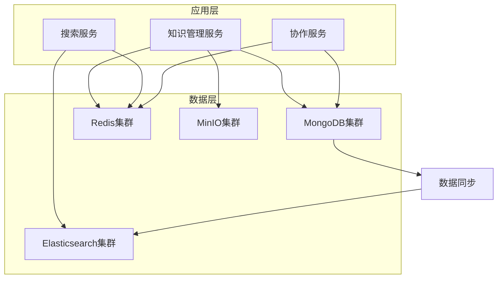

# 知识库管理数据库设计

## 版本信息
- **版本号**: 1.0.0
- **最后更新**: 2024-01-15
- **作者**: SiCal数据库团队
- **评审人**: 数据架构师
- **状态**: 草稿

## 更新日志
- v1.0.0 (2024-01-15): 初始版本，定义知识库管理数据库设计

---

## 1. 数据库架构概览

### 1.1 技术选型

#### 主数据库 - MongoDB
- **版本**: MongoDB 6.0+
- **用途**: 存储知识内容、元数据、用户数据
- **优势**: 文档型数据库，适合存储结构化和半结构化数据
- **集群配置**: 3节点副本集 + 分片集群

#### 搜索引擎 - Elasticsearch
- **版本**: Elasticsearch 8.0+
- **用途**: 全文搜索、智能推荐、数据分析
- **优势**: 强大的搜索和分析能力
- **集群配置**: 3个主节点 + 6个数据节点

#### 缓存数据库 - Redis
- **版本**: Redis 7.0+
- **用途**: 会话缓存、热点数据缓存、实时协作
- **优势**: 高性能内存数据库
- **集群配置**: Redis Cluster (6节点)

#### 对象存储 - MinIO
- **版本**: MinIO RELEASE.2023-12-07+
- **用途**: 存储文件附件、图片、视频等
- **优势**: S3兼容的对象存储
- **集群配置**: 4节点分布式部署

### 1.2 数据分布策略



### 1.3 数据一致性策略

#### 最终一致性模型
- **MongoDB**: 强一致性（主节点写入）
- **Elasticsearch**: 最终一致性（异步同步）
- **Redis**: 强一致性（集群模式）
- **MinIO**: 强一致性（分布式锁）

#### 数据同步机制
```javascript
// MongoDB Change Stream 监听数据变更
const changeStream = db.knowledge.watch([
  { $match: { 'fullDocument.status.current': 'published' } }
]);

changeStream.on('change', async (change) => {
  switch (change.operationType) {
    case 'insert':
    case 'update':
      await syncToElasticsearch(change.fullDocument);
      await invalidateCache(change.documentKey._id);
      break;
    case 'delete':
      await removeFromElasticsearch(change.documentKey._id);
      await invalidateCache(change.documentKey._id);
      break;
  }
});
```

---

## 2. MongoDB 集合设计

### 2.1 知识集合 (knowledge)

#### 集合结构
```javascript
{
  _id: ObjectId("507f1f77bcf86cd799439011"),
  title: "心脏解剖学基础",
  slug: "heart-anatomy-basics",
  summary: "介绍心脏的基本解剖结构和功能",
  content: {
    type: "html",
    data: "<h1>心脏解剖学</h1><p>心脏是人体循环系统的核心器官...</p>",
    wordCount: 2500,
    readingTime: 10,
    attachments: [
      {
        _id: ObjectId("507f1f77bcf86cd799439012"),
        type: "image",
        name: "心脏解剖图.jpg",
        url: "/files/2024/01/heart-anatomy.jpg",
        size: 1024000,
        mimeType: "image/jpeg",
        metadata: {
          width: 1920,
          height: 1080,
          format: "jpeg",
          colorSpace: "sRGB"
        },
        uploadedAt: ISODate("2024-01-15T10:30:00Z")
      }
    ],
    references: [
      {
        type: "book",
        title: "Gray's Anatomy",
        authors: ["Henry Gray"],
        publisher: "Churchill Livingstone",
        year: 2020,
        isbn: "978-0702077050",
        pages: "123-145"
      },
      {
        type: "journal",
        title: "Cardiac Anatomy and Physiology",
        authors: ["Smith J.", "Johnson K."],
        journal: "Journal of Cardiology",
        volume: 45,
        issue: 3,
        pages: "234-250",
        year: 2023,
        doi: "10.1016/j.jacc.2023.01.001"
      }
    ]
  },
  category: {
    primary: "解剖学",
    primaryId: ObjectId("507f1f77bcf86cd799439020"),
    secondary: "心血管系统",
    secondaryId: ObjectId("507f1f77bcf86cd799439021"),
    tags: ["心脏", "解剖", "基础医学", "循环系统"],
    customTags: ["医学教育", "临床基础"]
  },
  author: {
    userId: ObjectId("507f1f77bcf86cd799439013"),
    name: "张教授",
    email: "zhang.prof@university.edu",
    institution: "北京大学医学部",
    department: "解剖学系",
    title: "教授",
    orcid: "0000-0002-1825-0097"
  },
  collaborators: [
    {
      userId: ObjectId("507f1f77bcf86cd799439014"),
      name: "李医生",
      role: "editor",
      permissions: ["read", "write", "comment"],
      status: "active",
      invitedAt: ISODate("2024-01-15T11:00:00Z"),
      joinedAt: ISODate("2024-01-15T11:15:00Z"),
      lastActivity: ISODate("2024-01-15T16:45:00Z"),
      contributions: {
        edits: 8,
        reviews: 2,
        comments: 15
      }
    }
  ],
  status: {
    current: "published",
    publishedAt: ISODate("2024-01-15T12:00:00Z"),
    lastModified: ISODate("2024-01-15T11:30:00Z"),
    modifiedBy: ObjectId("507f1f77bcf86cd799439013"),
    workflow: {
      draft: {
        createdAt: ISODate("2024-01-15T10:30:00Z"),
        createdBy: ObjectId("507f1f77bcf86cd799439013")
      },
      review: {
        submittedAt: ISODate("2024-01-15T11:45:00Z"),
        submittedBy: ObjectId("507f1f77bcf86cd799439013"),
        reviewers: [
          {
            userId: ObjectId("507f1f77bcf86cd799439015"),
            assignedAt: ISODate("2024-01-15T11:45:00Z"),
            completedAt: ISODate("2024-01-15T11:55:00Z"),
            decision: "approved"
          }
        ]
      },
      published: {
        publishedAt: ISODate("2024-01-15T12:00:00Z"),
        publishedBy: ObjectId("507f1f77bcf86cd799439015")
      }
    }
  },
  quality: {
    score: 4.5,
    reviewCount: 12,
    reviews: [
      {
        _id: ObjectId("507f1f77bcf86cd799439016"),
        reviewerId: ObjectId("507f1f77bcf86cd799439017"),
        reviewerName: "王教授",
        reviewerInstitution: "清华大学医学院",
        score: 5,
        aspects: {
          accuracy: 5,
          clarity: 4,
          completeness: 5,
          relevance: 5
        },
        comment: "内容详实，图文并茂，非常适合初学者学习",
        suggestions: [
          "建议在心脏瓣膜部分增加动画演示",
          "可以添加一些临床案例"
        ],
        isPublic: true,
        reviewedAt: ISODate("2024-01-15T13:00:00Z"),
        helpfulCount: 23,
        reportCount: 0
      }
    ],
    certifications: [
      {
        type: "expert_reviewed",
        authority: "中华医学会",
        authorityId: "CMA-2024-001",
        certifiedAt: ISODate("2024-01-15T14:00:00Z"),
        validUntil: ISODate("2025-01-15T14:00:00Z"),
        certificate: {
          number: "CMA-KM-2024-001",
          url: "/certificates/CMA-KM-2024-001.pdf"
        }
      }
    ],
    flags: {
      inappropriate: 0,
      outdated: 0,
      inaccurate: 1,
      copyright: 0
    }
  },
  statistics: {
    views: {
      total: 1250,
      unique: 890,
      today: 45,
      thisWeek: 234,
      thisMonth: 567
    },
    engagement: {
      likes: 89,
      dislikes: 3,
      shares: 23,
      bookmarks: 67,
      downloads: 156,
      comments: 15,
      averageRating: 4.3
    },
    learning: {
      completions: 234,
      averageTime: 420,
      bounceRate: 0.15,
      progressTracking: {
        started: 456,
        halfway: 345,
        completed: 234
      }
    },
    search: {
      impressions: 2345,
      clicks: 567,
      ctr: 0.24,
      averagePosition: 3.2
    }
  },
  relations: {
    references: [
      {
        knowledgeId: ObjectId("507f1f77bcf86cd799439018"),
        title: "人体解剖学概论",
        type: "prerequisite",
        strength: 0.8
      }
    ],
    citedBy: [
      {
        knowledgeId: ObjectId("507f1f77bcf86cd799439019"),
        title: "心血管疾病诊断",
        citedAt: ISODate("2024-01-16T09:00:00Z"),
        citationType: "reference"
      }
    ],
    related: [
      {
        knowledgeId: ObjectId("507f1f77bcf86cd79943901a"),
        title: "心脏生理学",
        similarity: 0.85,
        calculatedAt: ISODate("2024-01-15T15:00:00Z")
      }
    ],
    prerequisites: [
      {
        knowledgeId: ObjectId("507f1f77bcf86cd79943901b"),
        title: "基础解剖学",
        required: true,
        order: 1
      }
    ],
    followups: [
      {
        knowledgeId: ObjectId("507f1f77bcf86cd79943901c"),
        title: "心脏病理学",
        recommended: true,
        order: 1
      }
    ]
  },
  metadata: {
    difficulty: "beginner",
    estimatedTime: 30,
    language: "zh-CN",
    keywords: ["心脏", "解剖学", "心房", "心室", "瓣膜", "血管"],
    version: "1.2.0",
    source: "original",
    license: {
      type: "CC BY-SA 4.0",
      url: "https://creativecommons.org/licenses/by-sa/4.0/",
      attribution: "张教授, 北京大学医学部"
    },
    accessibility: {
      hasAltText: true,
      hasTranscript: false,
      hasSubtitles: false,
      screenReaderFriendly: true
    },
    seo: {
      metaTitle: "心脏解剖学基础 - 完整的心脏结构介绍",
      metaDescription: "详细介绍心脏的解剖结构，包括心房、心室、瓣膜等组成部分，适合医学生和医护人员学习。",
      canonicalUrl: "/knowledge/heart-anatomy-basics",
      structuredData: {
        "@type": "EducationalResource",
        "@context": "https://schema.org",
        "name": "心脏解剖学基础",
        "description": "介绍心脏的基本解剖结构和功能",
        "educationalLevel": "beginner",
        "learningResourceType": "text"
      }
    }
  },
  createdAt: ISODate("2024-01-15T10:30:00Z"),
  updatedAt: ISODate("2024-01-15T11:30:00Z"),
  deletedAt: null,
  isDeleted: false
}
```

#### 索引设计
```javascript
// 复合索引
db.knowledge.createIndex({ "status.current": 1, "createdAt": -1 });
db.knowledge.createIndex({ "category.primaryId": 1, "status.current": 1 });
db.knowledge.createIndex({ "author.userId": 1, "status.current": 1 });
db.knowledge.createIndex({ "category.tags": 1, "status.current": 1 });

// 文本索引
db.knowledge.createIndex({
  "title": "text",
  "summary": "text",
  "content.data": "text",
  "category.tags": "text",
  "metadata.keywords": "text"
}, {
  weights: {
    "title": 10,
    "summary": 5,
    "content.data": 1,
    "category.tags": 3,
    "metadata.keywords": 2
  },
  name: "knowledge_text_index"
});

// 地理位置索引（如果需要）
db.knowledge.createIndex({ "metadata.location": "2dsphere" });

// 稀疏索引
db.knowledge.createIndex({ "slug": 1 }, { unique: true, sparse: true });
db.knowledge.createIndex({ "deletedAt": 1 }, { sparse: true });

// TTL索引（用于临时数据）
db.knowledge.createIndex({ "tempData.expiresAt": 1 }, { expireAfterSeconds: 0 });
```

### 2.2 知识版本集合 (knowledge_versions)

#### 集合结构
```javascript
{
  _id: ObjectId("507f1f77bcf86cd79943901d"),
  knowledgeId: ObjectId("507f1f77bcf86cd799439011"),
  version: "1.2.0",
  versionType: "minor",
  title: "心脏解剖学基础",
  content: {
    type: "html",
    data: "<h1>心脏解剖学</h1>...",
    wordCount: 2500,
    attachments: [...]
  },
  changes: {
    type: "update",
    description: "添加了最新的研究成果和高清解剖图",
    summary: "更新内容包括：1. 新增高清解剖图 2. 更新最新研究数据 3. 修正部分描述错误",
    diff: {
      added: [
        {
          type: "text",
          location: "第3章第2段",
          content: "根据2023年最新研究..."
        },
        {
          type: "attachment",
          location: "图片库",
          content: "heart-anatomy-hd.jpg"
        }
      ],
      removed: [
        {
          type: "text",
          location: "第2章第5段",
          content: "过时的研究数据..."
        }
      ],
      modified: [
        {
          type: "text",
          location: "第1章第3段",
          from: "心脏位于胸腔中央",
          to: "心脏位于胸腔中央偏左的位置"
        }
      ]
    },
    statistics: {
      totalChanges: 15,
      additions: 8,
      deletions: 3,
      modifications: 4,
      linesAdded: 45,
      linesRemoved: 12
    }
  },
  author: {
    userId: ObjectId("507f1f77bcf86cd799439013"),
    name: "张教授",
    email: "zhang.prof@university.edu"
  },
  status: "published",
  parentVersion: "1.1.0",
  childVersions: ["1.2.1", "1.3.0"],
  mergeInfo: {
    isMerged: true,
    mergedAt: ISODate("2024-01-15T12:00:00Z"),
    mergedBy: ObjectId("507f1f77bcf86cd799439013"),
    mergeStrategy: "auto",
    conflicts: []
  },
  approval: {
    required: true,
    approvers: [
      {
        userId: ObjectId("507f1f77bcf86cd799439015"),
        name: "王教授",
        approvedAt: ISODate("2024-01-15T11:55:00Z"),
        comment: "内容更新合理，批准发布"
      }
    ],
    status: "approved"
  },
  metadata: {
    size: 125000,
    checksum: "sha256:a1b2c3d4e5f6...",
    compression: "gzip",
    encoding: "utf-8"
  },
  createdAt: ISODate("2024-01-15T11:30:00Z"),
  publishedAt: ISODate("2024-01-15T12:00:00Z")
}
```

#### 索引设计
```javascript
db.knowledge_versions.createIndex({ "knowledgeId": 1, "version": -1 });
db.knowledge_versions.createIndex({ "knowledgeId": 1, "createdAt": -1 });
db.knowledge_versions.createIndex({ "author.userId": 1, "createdAt": -1 });
db.knowledge_versions.createIndex({ "status": 1, "createdAt": -1 });
```

### 2.3 分类集合 (categories)

#### 集合结构
```javascript
{
  _id: ObjectId("507f1f77bcf86cd799439020"),
  name: "基础医学",
  code: "basic_medicine",
  slug: "basic-medicine",
  description: "医学基础学科，包括解剖学、生理学、病理学等",
  parent: null,
  children: [
    ObjectId("507f1f77bcf86cd799439021"),
    ObjectId("507f1f77bcf86cd799439022")
  ],
  level: 1,
  path: "/基础医学",
  fullPath: ["基础医学"],
  icon: "medical-book",
  color: "#2196F3",
  image: "/images/categories/basic-medicine.jpg",
  order: 1,
  isActive: true,
  isVisible: true,
  metadata: {
    knowledgeCount: 234,
    totalViews: 45678,
    popularTags: ["解剖", "生理", "病理", "基础"],
    experts: [
      {
        userId: ObjectId("507f1f77bcf86cd799439013"),
        name: "张教授",
        knowledgeCount: 45,
        reputation: 4.8
      }
    ],
    difficulty: {
      beginner: 156,
      intermediate: 67,
      advanced: 11
    },
    languages: {
      "zh-CN": 200,
      "en-US": 34
    }
  },
  seo: {
    metaTitle: "基础医学知识库 - 解剖学、生理学、病理学",
    metaDescription: "基础医学知识库，包含解剖学、生理学、病理学等医学基础学科的专业知识内容。",
    keywords: ["基础医学", "解剖学", "生理学", "病理学", "医学教育"]
  },
  permissions: {
    view: ["public"],
    create: ["teacher", "expert"],
    edit: ["admin", "category_manager"],
    delete: ["admin"]
  },
  createdAt: ISODate("2024-01-01T00:00:00Z"),
  updatedAt: ISODate("2024-01-15T10:00:00Z"),
  createdBy: ObjectId("507f1f77bcf86cd799439001"),
  updatedBy: ObjectId("507f1f77bcf86cd799439001")
}
```

#### 索引设计
```javascript
db.categories.createIndex({ "parent": 1, "order": 1 });
db.categories.createIndex({ "level": 1, "order": 1 });
db.categories.createIndex({ "code": 1 }, { unique: true });
db.categories.createIndex({ "slug": 1 }, { unique: true });
db.categories.createIndex({ "isActive": 1, "isVisible": 1 });
```

### 2.4 协作会话集合 (collaboration_sessions)

#### 集合结构
```javascript
{
  _id: ObjectId("507f1f77bcf86cd799439030"),
  knowledgeId: ObjectId("507f1f77bcf86cd799439011"),
  sessionId: "collab-session-123456",
  participants: [
    {
      userId: ObjectId("507f1f77bcf86cd799439013"),
      name: "张教授",
      role: "owner",
      socketId: "socket-abc123",
      joinedAt: ISODate("2024-01-15T14:00:00Z"),
      lastActivity: ISODate("2024-01-15T14:30:00Z"),
      cursor: {
        position: 1250,
        selection: { start: 1250, end: 1280 }
      },
      isActive: true
    },
    {
      userId: ObjectId("507f1f77bcf86cd799439014"),
      name: "李医生",
      role: "editor",
      socketId: "socket-def456",
      joinedAt: ISODate("2024-01-15T14:05:00Z"),
      lastActivity: ISODate("2024-01-15T14:28:00Z"),
      cursor: {
        position: 890,
        selection: null
      },
      isActive: true
    }
  ],
  operations: [
    {
      _id: ObjectId("507f1f77bcf86cd799439031"),
      operationId: "op-123456",
      type: "insert",
      position: 1250,
      content: "新增的文本内容",
      length: 8,
      userId: ObjectId("507f1f77bcf86cd799439013"),
      timestamp: ISODate("2024-01-15T14:15:00Z"),
      baseVersion: "1.2.0",
      transformedFrom: null,
      acknowledged: true,
      applied: true
    },
    {
      _id: ObjectId("507f1f77bcf86cd799439032"),
      operationId: "op-123457",
      type: "delete",
      position: 890,
      length: 15,
      userId: ObjectId("507f1f77bcf86cd799439014"),
      timestamp: ISODate("2024-01-15T14:16:00Z"),
      baseVersion: "1.2.0",
      transformedFrom: "op-123456",
      acknowledged: true,
      applied: true
    }
  ],
  documentState: {
    version: "1.2.1",
    content: "当前文档的完整内容...",
    lastOperation: ObjectId("507f1f77bcf86cd799439032"),
    checksum: "sha256:b2c3d4e5f6g7..."
  },
  status: "active",
  startedAt: ISODate("2024-01-15T14:00:00Z"),
  lastActivity: ISODate("2024-01-15T14:30:00Z"),
  endedAt: null,
  metadata: {
    totalOperations: 25,
    totalParticipants: 3,
    maxConcurrentUsers: 2,
    averageSessionTime: 1800
  }
}
```

#### 索引设计
```javascript
db.collaboration_sessions.createIndex({ "knowledgeId": 1, "status": 1 });
db.collaboration_sessions.createIndex({ "sessionId": 1 }, { unique: true });
db.collaboration_sessions.createIndex({ "participants.userId": 1, "status": 1 });
db.collaboration_sessions.createIndex({ "lastActivity": 1 });
```

### 2.5 评审集合 (reviews)

#### 集合结构
```javascript
{
  _id: ObjectId("507f1f77bcf86cd799439040"),
  knowledgeId: ObjectId("507f1f77bcf86cd799439011"),
  version: "1.2.0",
  type: "peer_review",
  status: "completed",
  submitter: {
    userId: ObjectId("507f1f77bcf86cd799439013"),
    name: "张教授",
    submittedAt: ISODate("2024-01-15T11:45:00Z"),
    message: "请审核心脏解剖学文档的最新版本"
  },
  reviewers: [
    {
      userId: ObjectId("507f1f77bcf86cd799439015"),
      name: "王教授",
      institution: "清华大学医学院",
      expertise: ["心血管解剖", "医学教育"],
      assignedAt: ISODate("2024-01-15T11:45:00Z"),
      startedAt: ISODate("2024-01-15T12:30:00Z"),
      completedAt: ISODate("2024-01-15T13:15:00Z"),
      timeSpent: 2700,
      status: "completed",
      review: {
        overallScore: 4.5,
        aspects: {
          accuracy: {
            score: 5,
            comment: "内容准确，符合最新医学标准"
          },
          clarity: {
            score: 4,
            comment: "表述清晰，但部分专业术语需要解释"
          },
          completeness: {
            score: 5,
            comment: "内容完整，涵盖了心脏解剖的各个方面"
          },
          relevance: {
            score: 5,
            comment: "与教学目标高度相关"
          },
          originality: {
            score: 4,
            comment: "内容原创性较好，引用规范"
          }
        },
        comment: "这是一份高质量的心脏解剖学教学材料，内容详实，图文并茂。建议在心脏瓣膜部分增加更多的临床相关性内容。",
        suggestions: [
          {
            type: "addition",
            priority: "medium",
            location: "第3章 心脏瓣膜",
            content: "建议增加瓣膜疾病的临床表现",
            reasoning: "有助于学生理解解剖结构与临床的关系"
          },
          {
            type: "improvement",
            priority: "low",
            location: "图片说明",
            content: "建议为所有解剖图片添加中英文对照标注",
            reasoning: "便于国际学生学习"
          }
        ],
        strengths: [
          "内容结构清晰，逻辑性强",
          "图片质量高，标注准确",
          "参考文献权威且最新"
        ],
        weaknesses: [
          "部分专业术语缺乏解释",
          "临床相关性可以进一步加强"
        ],
        decision: "approved_with_minor_revisions",
        confidenceLevel: "high"
      },
      files: [
        {
          type: "annotated_pdf",
          name: "review_annotations.pdf",
          url: "/files/reviews/review_annotations.pdf",
          size: 2048000
        }
      ]
    }
  ],
  workflow: {
    currentStage: "completed",
    stages: [
      {
        name: "submission",
        status: "completed",
        completedAt: ISODate("2024-01-15T11:45:00Z")
      },
      {
        name: "assignment",
        status: "completed",
        completedAt: ISODate("2024-01-15T11:45:00Z")
      },
      {
        name: "review",
        status: "completed",
        completedAt: ISODate("2024-01-15T13:15:00Z")
      },
      {
        name: "decision",
        status: "completed",
        completedAt: ISODate("2024-01-15T13:30:00Z")
      }
    ]
  },
  finalDecision: {
    result: "approved_with_minor_revisions",
    decidedBy: ObjectId("507f1f77bcf86cd799439001"),
    decidedAt: ISODate("2024-01-15T13:30:00Z"),
    summary: "经专家评审，该知识内容质量较高，建议进行小幅修订后发布。",
    requiredActions: [
      "增加心脏瓣膜的临床相关内容",
      "为专业术语添加解释"
    ],
    deadline: ISODate("2024-01-20T23:59:59Z")
  },
  statistics: {
    totalReviewers: 1,
    completedReviews: 1,
    averageScore: 4.5,
    averageReviewTime: 2700,
    consensusLevel: 1.0
  },
  createdAt: ISODate("2024-01-15T11:45:00Z"),
  updatedAt: ISODate("2024-01-15T13:30:00Z"),
  completedAt: ISODate("2024-01-15T13:30:00Z")
}
```

#### 索引设计
```javascript
db.reviews.createIndex({ "knowledgeId": 1, "status": 1 });
db.reviews.createIndex({ "reviewers.userId": 1, "status": 1 });
db.reviews.createIndex({ "submitter.userId": 1, "createdAt": -1 });
db.reviews.createIndex({ "type": 1, "status": 1 });
```

---

## 3. Elasticsearch 索引设计

### 3.1 知识搜索索引 (knowledge_search)

#### 索引映射
```json
{
  "mappings": {
    "properties": {
      "id": {
        "type": "keyword"
      },
      "title": {
        "type": "text",
        "analyzer": "ik_max_word",
        "search_analyzer": "ik_smart",
        "fields": {
          "keyword": {
            "type": "keyword"
          },
          "suggest": {
            "type": "completion",
            "analyzer": "simple",
            "preserve_separators": true,
            "preserve_position_increments": true,
            "max_input_length": 50
          },
          "pinyin": {
            "type": "text",
            "analyzer": "pinyin_analyzer"
          }
        }
      },
      "summary": {
        "type": "text",
        "analyzer": "ik_max_word",
        "search_analyzer": "ik_smart"
      },
      "content": {
        "type": "text",
        "analyzer": "ik_max_word",
        "search_analyzer": "ik_smart",
        "fields": {
          "raw": {
            "type": "text",
            "analyzer": "standard"
          }
        }
      },
      "category": {
        "type": "object",
        "properties": {
          "primary": {
            "type": "keyword"
          },
          "primaryId": {
            "type": "keyword"
          },
          "secondary": {
            "type": "keyword"
          },
          "secondaryId": {
            "type": "keyword"
          },
          "tags": {
            "type": "keyword"
          },
          "customTags": {
            "type": "keyword"
          }
        }
      },
      "author": {
        "type": "object",
        "properties": {
          "userId": {
            "type": "keyword"
          },
          "name": {
            "type": "text",
            "analyzer": "ik_max_word",
            "fields": {
              "keyword": {
                "type": "keyword"
              }
            }
          },
          "institution": {
            "type": "keyword"
          },
          "department": {
            "type": "keyword"
          }
        }
      },
      "status": {
        "type": "object",
        "properties": {
          "current": {
            "type": "keyword"
          },
          "publishedAt": {
            "type": "date"
          },
          "lastModified": {
            "type": "date"
          }
        }
      },
      "quality": {
        "type": "object",
        "properties": {
          "score": {
            "type": "float"
          },
          "reviewCount": {
            "type": "integer"
          }
        }
      },
      "statistics": {
        "type": "object",
        "properties": {
          "views": {
            "type": "object",
            "properties": {
              "total": {
                "type": "integer"
              },
              "unique": {
                "type": "integer"
              }
            }
          },
          "engagement": {
            "type": "object",
            "properties": {
              "likes": {
                "type": "integer"
              },
              "shares": {
                "type": "integer"
              },
              "bookmarks": {
                "type": "integer"
              },
              "averageRating": {
                "type": "float"
              }
            }
          }
        }
      },
      "metadata": {
        "type": "object",
        "properties": {
          "difficulty": {
            "type": "keyword"
          },
          "estimatedTime": {
            "type": "integer"
          },
          "language": {
            "type": "keyword"
          },
          "keywords": {
            "type": "keyword"
          },
          "version": {
            "type": "keyword"
          }
        }
      },
      "relations": {
        "type": "object",
        "properties": {
          "related": {
            "type": "nested",
            "properties": {
              "knowledgeId": {
                "type": "keyword"
              },
              "title": {
                "type": "text",
                "analyzer": "ik_max_word"
              },
              "similarity": {
                "type": "float"
              }
            }
          }
        }
      },
      "createdAt": {
        "type": "date"
      },
      "updatedAt": {
        "type": "date"
      },
      "boost": {
        "type": "float"
      }
    }
  },
  "settings": {
    "number_of_shards": 3,
    "number_of_replicas": 1,
    "analysis": {
      "analyzer": {
        "ik_max_word": {
          "type": "ik_max_word"
        },
        "ik_smart": {
          "type": "ik_smart"
        },
        "pinyin_analyzer": {
          "tokenizer": "my_pinyin"
        }
      },
      "tokenizer": {
        "my_pinyin": {
          "type": "pinyin",
          "keep_separate_first_letter": false,
          "keep_full_pinyin": true,
          "keep_original": true,
          "limit_first_letter_length": 16,
          "lowercase": true,
          "remove_duplicated_term": true
        }
      }
    }
  }
}
```

### 3.2 用户行为分析索引 (user_behavior)

#### 索引映射
```json
{
  "mappings": {
    "properties": {
      "userId": {
        "type": "keyword"
      },
      "sessionId": {
        "type": "keyword"
      },
      "action": {
        "type": "keyword"
      },
      "target": {
        "type": "object",
        "properties": {
          "type": {
            "type": "keyword"
          },
          "id": {
            "type": "keyword"
          },
          "title": {
            "type": "text",
            "analyzer": "ik_max_word"
          }
        }
      },
      "context": {
        "type": "object",
        "properties": {
          "page": {
            "type": "keyword"
          },
          "referrer": {
            "type": "keyword"
          },
          "userAgent": {
            "type": "keyword"
          },
          "ip": {
            "type": "ip"
          },
          "location": {
            "type": "geo_point"
          }
        }
      },
      "timestamp": {
        "type": "date"
      },
      "duration": {
        "type": "integer"
      }
    }
  },
  "settings": {
    "number_of_shards": 5,
    "number_of_replicas": 1,
    "index": {
      "lifecycle": {
        "name": "user_behavior_policy",
        "rollover_alias": "user_behavior"
      }
    }
  }
}
```

---

## 4. Redis 缓存设计

### 4.1 缓存键命名规范

```javascript
// 缓存键命名规范
const CACHE_KEYS = {
  // 知识相关
  KNOWLEDGE: {
    DETAIL: 'knowledge:detail:{id}',
    LIST: 'knowledge:list:{category}:{page}:{size}',
    POPULAR: 'knowledge:popular:{period}',
    RELATED: 'knowledge:related:{id}',
    STATISTICS: 'knowledge:stats:{id}:{period}'
  },
  
  // 搜索相关
  SEARCH: {
    RESULT: 'search:result:{hash}',
    SUGGESTION: 'search:suggestion:{query}',
    TRENDING: 'search:trending:{period}',
    HISTORY: 'search:history:{userId}'
  },
  
  // 用户相关
  USER: {
    PROFILE: 'user:profile:{userId}',
    PREFERENCES: 'user:preferences:{userId}',
    RECOMMENDATIONS: 'user:recommendations:{userId}',
    ACTIVITY: 'user:activity:{userId}:{date}'
  },
  
  // 分类相关
  CATEGORY: {
    TREE: 'category:tree',
    KNOWLEDGE_COUNT: 'category:count:{categoryId}',
    POPULAR_TAGS: 'category:tags:{categoryId}'
  },
  
  // 协作相关
  COLLABORATION: {
    SESSION: 'collab:session:{knowledgeId}',
    PARTICIPANTS: 'collab:participants:{sessionId}',
    OPERATIONS: 'collab:operations:{sessionId}',
    DOCUMENT_STATE: 'collab:state:{knowledgeId}'
  },
  
  // 系统相关
  SYSTEM: {
    CONFIG: 'system:config',
    STATS: 'system:stats:{date}',
    HEALTH: 'system:health'
  }
};
```

### 4.2 缓存数据结构

#### 知识详情缓存
```javascript
// 使用 Hash 结构存储知识详情
const knowledgeCache = {
  key: 'knowledge:detail:507f1f77bcf86cd799439011',
  type: 'hash',
  ttl: 1800, // 30分钟
  data: {
    id: '507f1f77bcf86cd799439011',
    title: '心脏解剖学基础',
    summary: '介绍心脏的基本解剖结构',
    content: JSON.stringify({
      type: 'html',
      data: '<h1>心脏解剖学</h1>...'
    }),
    category: JSON.stringify({
      primary: '解剖学',
      tags: ['心脏', '解剖']
    }),
    author: JSON.stringify({
      name: '张教授',
      institution: '北京大学医学部'
    }),
    statistics: JSON.stringify({
      views: 1250,
      likes: 89
    }),
    updatedAt: '2024-01-15T11:30:00Z'
  }
};
```

#### 搜索结果缓存
```javascript
// 使用 String 结构存储搜索结果
const searchCache = {
  key: 'search:result:' + hashQuery({
    q: '心脏解剖',
    category: '解剖学',
    page: 1,
    size: 20
  }),
  type: 'string',
  ttl: 600, // 10分钟
  data: JSON.stringify({
    total: 156,
    results: [...],
    aggregations: {...},
    timestamp: '2024-01-15T14:30:00Z'
  })
};
```

#### 用户推荐缓存
```javascript
// 使用 List 结构存储推荐列表
const recommendationCache = {
  key: 'user:recommendations:507f1f77bcf86cd799439013',
  type: 'list',
  ttl: 3600, // 1小时
  data: [
    JSON.stringify({
      knowledgeId: '507f1f77bcf86cd799439011',
      score: 0.95,
      reason: 'content_similarity'
    }),
    JSON.stringify({
      knowledgeId: '507f1f77bcf86cd799439012',
      score: 0.87,
      reason: 'collaborative_filtering'
    })
  ]
};
```

#### 实时协作缓存
```javascript
// 使用 Hash 结构存储协作会话
const collaborationCache = {
  key: 'collab:session:507f1f77bcf86cd799439011',
  type: 'hash',
  ttl: 7200, // 2小时
  data: {
    sessionId: 'collab-session-123456',
    participants: JSON.stringify([
      {
        userId: '507f1f77bcf86cd799439013',
        socketId: 'socket-abc123',
        cursor: { position: 1250 }
      }
    ]),
    documentState: JSON.stringify({
      version: '1.2.1',
      lastOperation: 'op-123456'
    }),
    lastActivity: '2024-01-15T14:30:00Z'
  }
};

// 使用 List 结构存储操作历史
const operationsCache = {
  key: 'collab:operations:collab-session-123456',
  type: 'list',
  ttl: 3600, // 1小时
  maxLength: 1000, // 最多保存1000个操作
  data: [
    JSON.stringify({
      operationId: 'op-123456',
      type: 'insert',
      position: 1250,
      content: '新增内容',
      userId: '507f1f77bcf86cd799439013',
      timestamp: '2024-01-15T14:15:00Z'
    })
  ]
};
```

### 4.3 缓存策略配置

```javascript
const cacheConfig = {
  // 知识内容缓存策略
  knowledge: {
    detail: {
      ttl: 1800, // 30分钟
      strategy: 'write_through',
      invalidateOn: ['knowledge.updated', 'knowledge.deleted']
    },
    list: {
      ttl: 600, // 10分钟
      strategy: 'cache_aside',
      invalidateOn: ['knowledge.created', 'knowledge.updated']
    },
    statistics: {
      ttl: 300, // 5分钟
      strategy: 'write_behind',
      batchSize: 100
    }
  },
  
  // 搜索结果缓存策略
  search: {
    result: {
      ttl: 600, // 10分钟
      strategy: 'cache_aside',
      maxSize: 10000 // 最多缓存10000个搜索结果
    },
    suggestion: {
      ttl: 3600, // 1小时
      strategy: 'refresh_ahead',
      refreshThreshold: 0.8
    }
  },
  
  // 用户数据缓存策略
  user: {
    profile: {
      ttl: 3600, // 1小时
      strategy: 'write_through'
    },
    recommendations: {
      ttl: 3600, // 1小时
      strategy: 'lazy_loading',
      refreshInterval: 1800 // 30分钟刷新一次
    }
  }
};
```

---

## 5. 数据一致性保证

### 5.1 事务处理

#### MongoDB 事务示例
```javascript
class KnowledgeService {
  async createKnowledgeWithTransaction(knowledgeData, userId) {
    const session = await mongoose.startSession();
    
    try {
      await session.withTransaction(async () => {
        // 1. 创建知识记录
        const knowledge = await Knowledge.create([knowledgeData], { session });
        
        // 2. 创建初始版本
        await KnowledgeVersion.create([{
          knowledgeId: knowledge[0]._id,
          version: '1.0.0',
          content: knowledgeData.content,
          author: { userId },
          changes: { type: 'create', description: '初始创建' }
        }], { session });
        
        // 3. 更新分类统计
        await Category.updateOne(
          { _id: knowledgeData.category.primaryId },
          { $inc: { 'metadata.knowledgeCount': 1 } },
          { session }
        );
        
        // 4. 记录用户活动
        await UserActivity.create([{
          userId,
          action: 'knowledge_created',
          target: { type: 'knowledge', id: knowledge[0]._id },
          timestamp: new Date()
        }], { session });
        
        return knowledge[0];
      });
    } finally {
      await session.endSession();
    }
  }
}
```

### 5.2 缓存一致性

#### 缓存失效策略
```javascript
class CacheInvalidationService {
  constructor() {
    this.eventBus = new EventEmitter();
    this.setupEventHandlers();
  }
  
  setupEventHandlers() {
    // 监听知识更新事件
    this.eventBus.on('knowledge.updated', async (data) => {
      const { knowledgeId, categoryId, authorId } = data;
      
      // 失效相关缓存
      await Promise.all([
        this.invalidateKnowledgeCache(knowledgeId),
        this.invalidateCategoryCache(categoryId),
        this.invalidateUserCache(authorId),
        this.invalidateSearchCache(),
        this.invalidateRecommendationCache()
      ]);
    });
    
    // 监听搜索行为事件
    this.eventBus.on('search.performed', async (data) => {
      const { userId, query, results } = data;
      
      // 更新搜索统计缓存
      await this.updateSearchStatistics(query, results.length);
      
      // 更新用户行为缓存
      await this.updateUserBehaviorCache(userId, 'search', { query });
    });
  }
  
  async invalidateKnowledgeCache(knowledgeId) {
    const patterns = [
      `knowledge:detail:${knowledgeId}`,
      `knowledge:related:${knowledgeId}`,
      `knowledge:stats:${knowledgeId}:*`,
      `knowledge:list:*` // 失效所有列表缓存
    ];
    
    for (const pattern of patterns) {
      await this.redis.del(await this.redis.keys(pattern));
    }
  }
  
  async invalidateSearchCache() {
    // 失效所有搜索结果缓存
    const searchKeys = await this.redis.keys('search:result:*');
    if (searchKeys.length > 0) {
      await this.redis.del(searchKeys);
    }
  }
}
```

### 5.3 数据同步机制

#### MongoDB 到 Elasticsearch 同步
```javascript
class DataSyncService {
  constructor() {
    this.mongodb = mongoose.connection;
    this.elasticsearch = new Client({ node: 'http://localhost:9200' });
    this.setupChangeStreams();
  }
  
  setupChangeStreams() {
    // 监听知识集合变更
    const knowledgeChangeStream = this.mongodb.collection('knowledge')
      .watch([
        { $match: { 'fullDocument.status.current': 'published' } }
      ], { fullDocument: 'updateLookup' });
    
    knowledgeChangeStream.on('change', async (change) => {
      try {
        switch (change.operationType) {
          case 'insert':
          case 'update':
            await this.syncKnowledgeToES(change.fullDocument);
            break;
          case 'delete':
            await this.removeKnowledgeFromES(change.documentKey._id);
            break;
        }
      } catch (error) {
        console.error('同步到Elasticsearch失败:', error);
        // 记录失败的同步任务，稍后重试
        await this.recordFailedSync(change);
      }
    });
  }
  
  async syncKnowledgeToES(knowledge) {
    const esDoc = this.transformForES(knowledge);
    
    await this.elasticsearch.index({
      index: 'knowledge_search',
      id: knowledge._id.toString(),
      body: esDoc
    });
  }
  
  transformForES(knowledge) {
    return {
      id: knowledge._id.toString(),
      title: knowledge.title,
      summary: knowledge.summary,
      content: knowledge.content.data,
      category: {
        primary: knowledge.category.primary,
        primaryId: knowledge.category.primaryId.toString(),
        secondary: knowledge.category.secondary,
        secondaryId: knowledge.category.secondaryId?.toString(),
        tags: knowledge.category.tags,
        customTags: knowledge.category.customTags
      },
      author: {
        userId: knowledge.author.userId.toString(),
        name: knowledge.author.name,
        institution: knowledge.author.institution,
        department: knowledge.author.department
      },
      status: {
        current: knowledge.status.current,
        publishedAt: knowledge.status.publishedAt,
        lastModified: knowledge.status.lastModified
      },
      quality: {
        score: knowledge.quality.score,
        reviewCount: knowledge.quality.reviewCount
      },
      statistics: {
        views: knowledge.statistics.views,
        engagement: knowledge.statistics.engagement
      },
      metadata: {
        difficulty: knowledge.metadata.difficulty,
        estimatedTime: knowledge.metadata.estimatedTime,
        language: knowledge.metadata.language,
        keywords: knowledge.metadata.keywords,
        version: knowledge.metadata.version
      },
      relations: {
        related: knowledge.relations.related?.map(r => ({
          knowledgeId: r.knowledgeId.toString(),
          title: r.title,
          similarity: r.similarity
        })) || []
      },
      createdAt: knowledge.createdAt,
      updatedAt: knowledge.updatedAt,
      boost: this.calculateBoost(knowledge)
    };
  }
  
  calculateBoost(knowledge) {
    let boost = 1.0;
    
    // 基于质量评分的权重
    if (knowledge.quality.score >= 4.5) boost += 0.3;
    else if (knowledge.quality.score >= 4.0) boost += 0.2;
    else if (knowledge.quality.score >= 3.5) boost += 0.1;
    
    // 基于浏览量的权重
    if (knowledge.statistics.views.total >= 10000) boost += 0.2;
    else if (knowledge.statistics.views.total >= 1000) boost += 0.1;
    
    // 基于最新程度的权重
    const daysSinceUpdate = (Date.now() - knowledge.updatedAt) / (1000 * 60 * 60 * 24);
    if (daysSinceUpdate <= 30) boost += 0.1;
    
    return boost;
  }
}
```

---

## 6. 性能优化策略

### 6.1 查询优化

#### MongoDB 查询优化
```javascript
// 使用聚合管道优化复杂查询
class KnowledgeQueryOptimizer {
  // 获取热门知识列表（优化版）
  async getPopularKnowledge(categoryId, limit = 20) {
    return await Knowledge.aggregate([
      // 1. 匹配条件
      {
        $match: {
          'status.current': 'published',
          'category.primaryId': new ObjectId(categoryId),
          'isDeleted': false
        }
      },
      
      // 2. 添加计算字段
      {
        $addFields: {
          popularityScore: {
            $add: [
              { $multiply: ['$statistics.views.total', 0.3] },
              { $multiply: ['$statistics.engagement.likes', 2] },
              { $multiply: ['$statistics.engagement.shares', 3] },
              { $multiply: ['$quality.score', 100] }
            ]
          }
        }
      },
      
      // 3. 排序
      { $sort: { popularityScore: -1, 'status.publishedAt': -1 } },
      
      // 4. 限制结果
      { $limit: limit },
      
      // 5. 投影需要的字段
      {
        $project: {
          title: 1,
          summary: 1,
          'author.name': 1,
          'author.institution': 1,
          'category.tags': 1,
          'quality.score': 1,
          'statistics.views.total': 1,
          'statistics.engagement.likes': 1,
          'status.publishedAt': 1,
          popularityScore: 1
        }
      }
    ]);
  }
  
  // 获取用户推荐知识（优化版）
  async getRecommendedKnowledge(userId, limit = 10) {
    return await Knowledge.aggregate([
      // 1. 查找用户历史行为
      {
        $lookup: {
          from: 'user_activities',
          let: { knowledgeId: '$_id' },
          pipeline: [
            {
              $match: {
                $expr: {
                  $and: [
                    { $eq: ['$userId', new ObjectId(userId)] },
                    { $eq: ['$target.id', '$$knowledgeId'] },
                    { $in: ['$action', ['view', 'like', 'bookmark']] }
                  ]
                }
              }
            }
          ],
          as: 'userInteractions'
        }
      },
      
      // 2. 过滤已交互的内容
      {
        $match: {
          'userInteractions': { $size: 0 },
          'status.current': 'published'
        }
      },
      
      // 3. 计算推荐分数
      {
        $addFields: {
          recommendationScore: {
            $add: [
              { $multiply: ['$quality.score', 20] },
              { $multiply: ['$statistics.engagement.averageRating', 15] },
              {
                $cond: {
                  if: { $gte: ['$statistics.views.total', 1000] },
                  then: 10,
                  else: 0
                }
              }
            ]
          }
        }
      },
      
      // 4. 排序和限制
      { $sort: { recommendationScore: -1 } },
      { $limit: limit }
    ]);
  }
}
```

#### Elasticsearch 查询优化
```javascript
class SearchQueryOptimizer {
  // 智能搜索查询（优化版）
  async intelligentSearch(query, options = {}) {
    const searchBody = {
      query: {
        bool: {
          must: [
            {
              multi_match: {
                query: query,
                fields: [
                  'title^3',
                  'title.pinyin^2',
                  'summary^2',
                  'content',
                  'category.tags^2',
                  'metadata.keywords^2',
                  'author.name'
                ],
                type: 'best_fields',
                fuzziness: 'AUTO',
                prefix_length: 2
              }
            }
          ],
          filter: [
            { term: { 'status.current': 'published' } }
          ],
          should: [
            // 提升高质量内容
            {
              range: {
                'quality.score': {
                  gte: 4.0,
                  boost: 1.5
                }
              }
            },
            // 提升最近更新的内容
            {
              range: {
                'status.lastModified': {
                  gte: 'now-30d',
                  boost: 1.2
                }
              }
            },
            // 提升热门内容
            {
              range: {
                'statistics.views.total': {
                  gte: 1000,
                  boost: 1.3
                }
              }
            }
          ],
          minimum_should_match: 0
        }
      },
      
      // 高亮设置
      highlight: {
        fields: {
          title: { fragment_size: 150, number_of_fragments: 1 },
          summary: { fragment_size: 200, number_of_fragments: 2 },
          content: { fragment_size: 300, number_of_fragments: 3 }
        },
        pre_tags: ['<mark>'],
        post_tags: ['</mark>']
      },
      
      // 聚合统计
      aggs: {
        categories: {
          terms: {
            field: 'category.primary',
            size: 10
          }
        },
        difficulty_levels: {
          terms: {
            field: 'metadata.difficulty',
            size: 5
          }
        },
        authors: {
          terms: {
            field: 'author.name.keyword',
            size: 10
          }
        }
      },
      
      // 分页
      from: (options.page - 1) * options.size || 0,
      size: options.size || 20,
      
      // 排序
      sort: this.buildSortCriteria(options.sort)
    };
    
    // 添加过滤条件
    if (options.category) {
      searchBody.query.bool.filter.push({
        term: { 'category.primary': options.category }
      });
    }
    
    if (options.difficulty) {
      searchBody.query.bool.filter.push({
        term: { 'metadata.difficulty': options.difficulty }
      });
    }
    
    if (options.author) {
      searchBody.query.bool.filter.push({
        term: { 'author.userId': options.author }
      });
    }
    
    return await this.elasticsearch.search({
      index: 'knowledge_search',
      body: searchBody
    });
  }
  
  buildSortCriteria(sortOption) {
    switch (sortOption) {
      case 'relevance':
        return [{ _score: { order: 'desc' } }];
      case 'newest':
        return [{ 'status.publishedAt': { order: 'desc' } }];
      case 'popular':
        return [{ 'statistics.views.total': { order: 'desc' } }];
      case 'rating':
        return [{ 'quality.score': { order: 'desc' } }];
      default:
        return [
          { _score: { order: 'desc' } },
          { 'status.publishedAt': { order: 'desc' } }
        ];
    }
  }
}
```

### 6.2 索引优化

#### 复合索引策略
```javascript
// 基于查询模式的索引优化
const indexOptimization = {
  // 知识查询索引
  knowledgeIndexes: [
    // 状态 + 分类 + 发布时间（用于分类页面）
    { 'status.current': 1, 'category.primaryId': 1, 'status.publishedAt': -1 },
    
    // 状态 + 作者 + 创建时间（用于作者页面）
    { 'status.current': 1, 'author.userId': 1, 'createdAt': -1 },
    
    // 状态 + 标签 + 质量评分（用于标签搜索）
    { 'status.current': 1, 'category.tags': 1, 'quality.score': -1 },
    
    // 状态 + 浏览量（用于热门排序）
    { 'status.current': 1, 'statistics.views.total': -1 },
    
    // 稀疏索引（用于已删除内容）
    { 'deletedAt': 1 }, // sparse: true
    
    // 部分索引（仅索引已发布内容）
    { 'category.primaryId': 1, 'quality.score': -1 }, // partialFilterExpression: { 'status.current': 'published' }
  ],
  
  // 版本查询索引
  versionIndexes: [
    { 'knowledgeId': 1, 'version': -1 },
    { 'knowledgeId': 1, 'createdAt': -1 },
    { 'status': 1, 'createdAt': -1 }
  ],
  
  // 协作查询索引
  collaborationIndexes: [
    { 'knowledgeId': 1, 'status': 1 },
    { 'participants.userId': 1, 'status': 1 },
    { 'lastActivity': 1 } // TTL索引，自动清理过期会话
  ]
};
```

### 6.3 缓存策略优化

#### 多级缓存架构
```javascript
class MultiLevelCache {
  constructor() {
    this.l1Cache = new Map(); // 内存缓存（最快）
    this.l2Cache = redis; // Redis缓存（快）
    this.l3Cache = mongodb; // 数据库（慢）
  }
  
  async get(key, options = {}) {
    // L1: 内存缓存
    if (this.l1Cache.has(key)) {
      return this.l1Cache.get(key);
    }
    
    // L2: Redis缓存
    const redisValue = await this.l2Cache.get(key);
    if (redisValue) {
      const data = JSON.parse(redisValue);
      // 回填L1缓存
      this.l1Cache.set(key, data);
      return data;
    }
    
    // L3: 数据库查询
    if (options.fallbackQuery) {
      const data = await options.fallbackQuery();
      if (data) {
        // 回填所有缓存层
        await this.set(key, data, options.ttl);
        return data;
      }
    }
    
    return null;
  }
  
  async set(key, value, ttl = 3600) {
    // 设置L1缓存
    this.l1Cache.set(key, value);
    
    // 设置L2缓存
    await this.l2Cache.setex(key, ttl, JSON.stringify(value));
    
    // L1缓存大小控制
    if (this.l1Cache.size > 10000) {
      const firstKey = this.l1Cache.keys().next().value;
      this.l1Cache.delete(firstKey);
    }
  }
  
  async invalidate(pattern) {
    // 清除L1缓存
    for (const key of this.l1Cache.keys()) {
      if (key.includes(pattern)) {
        this.l1Cache.delete(key);
      }
    }
    
    // 清除L2缓存
    const keys = await this.l2Cache.keys(`*${pattern}*`);
    if (keys.length > 0) {
      await this.l2Cache.del(keys);
    }
  }
}
```

---

## 7. 数据备份与恢复

### 7.1 备份策略

#### MongoDB 备份
```bash
#!/bin/bash
# MongoDB 备份脚本

BACKUP_DIR="/backup/mongodb"
DATE=$(date +"%Y%m%d_%H%M%S")
BACKUP_NAME="sical_knowledge_${DATE}"

# 创建备份目录
mkdir -p ${BACKUP_DIR}/${DATE}

# 执行备份
mongodump \
  --host="mongodb-cluster:27017" \
  --db="sical_knowledge" \
  --out="${BACKUP_DIR}/${DATE}" \
  --gzip \
  --oplog

# 压缩备份文件
tar -czf "${BACKUP_DIR}/${BACKUP_NAME}.tar.gz" -C "${BACKUP_DIR}" "${DATE}"

# 清理临时文件
rm -rf "${BACKUP_DIR}/${DATE}"

# 上传到云存储
aws s3 cp "${BACKUP_DIR}/${BACKUP_NAME}.tar.gz" "s3://sical-backups/mongodb/"

# 清理本地旧备份（保留7天）
find ${BACKUP_DIR} -name "*.tar.gz" -mtime +7 -delete
```

#### Elasticsearch 备份
```bash
#!/bin/bash
# Elasticsearch 备份脚本

ES_HOST="http://elasticsearch-cluster:9200"
BACKUP_REPO="sical_backup_repo"
SNAPSHOT_NAME="knowledge_$(date +"%Y%m%d_%H%M%S")"

# 创建快照
curl -X PUT "${ES_HOST}/_snapshot/${BACKUP_REPO}/${SNAPSHOT_NAME}" \
  -H "Content-Type: application/json" \
  -d '{
    "indices": "knowledge_search,user_behavior",
    "ignore_unavailable": true,
    "include_global_state": false,
    "metadata": {
      "taken_by": "backup_script",
      "taken_because": "scheduled_backup"
    }
  }'

# 检查快照状态
curl -X GET "${ES_HOST}/_snapshot/${BACKUP_REPO}/${SNAPSHOT_NAME}"
```

### 7.2 恢复策略

#### 数据恢复脚本
```bash
#!/bin/bash
# 数据恢复脚本

RESTORE_TYPE=$1  # full, partial, point_in_time
BACKUP_DATE=$2

case $RESTORE_TYPE in
  "full")
    echo "执行完整恢复..."
    # 停止应用服务
    docker-compose stop app
    
    # 恢复MongoDB
    mongorestore \
      --host="mongodb-cluster:27017" \
      --db="sical_knowledge" \
      --gzip \
      --oplogReplay \
      "/backup/mongodb/${BACKUP_DATE}/sical_knowledge"
    
    # 恢复Elasticsearch
    curl -X POST "http://elasticsearch-cluster:9200/_snapshot/sical_backup_repo/knowledge_${BACKUP_DATE}/_restore"
    
    # 重启应用服务
    docker-compose start app
    ;;
    
  "partial")
    echo "执行部分恢复..."
    # 恢复特定集合
    mongorestore \
      --host="mongodb-cluster:27017" \
      --db="sical_knowledge" \
      --collection="knowledge" \
      "/backup/mongodb/${BACKUP_DATE}/sical_knowledge/knowledge.bson.gz"
    ;;
    
  "point_in_time")
    echo "执行时间点恢复..."
    # 使用oplog进行时间点恢复
    mongorestore \
      --host="mongodb-cluster:27017" \
      --oplogReplay \
      --oplogLimit="$(date -d "$3" +%s):0" \
      "/backup/mongodb/${BACKUP_DATE}"
    ;;
esac
```

---

## 8. 监控与维护

### 8.1 性能监控

#### 数据库性能指标
```javascript
class DatabaseMonitor {
  constructor() {
    this.metrics = {
      mongodb: {
        connections: 0,
        operations: { insert: 0, query: 0, update: 0, delete: 0 },
        replication: { lag: 0, status: 'healthy' },
        storage: { dataSize: 0, indexSize: 0 }
      },
      elasticsearch: {
        clusterHealth: 'green',
        indexingRate: 0,
        searchRate: 0,
        memoryUsage: 0
      },
      redis: {
        memoryUsage: 0,
        hitRate: 0,
        connections: 0,
        operations: 0
      }
    };
  }
  
  async collectMetrics() {
    // MongoDB 指标收集
    const mongoStats = await this.mongodb.admin().serverStatus();
    this.metrics.mongodb.connections = mongoStats.connections.current;
    this.metrics.mongodb.operations = mongoStats.opcounters;
    
    // Elasticsearch 指标收集
    const esStats = await this.elasticsearch.cluster.health();
    this.metrics.elasticsearch.clusterHealth = esStats.body.status;
    
    // Redis 指标收集
    const redisInfo = await this.redis.info();
    this.metrics.redis.memoryUsage = this.parseRedisInfo(redisInfo, 'used_memory');
    
    // 发送到监控系统
    await this.sendToMonitoring(this.metrics);
  }
  
  async checkSlowQueries() {
    // MongoDB 慢查询检查
    const slowQueries = await this.mongodb.collection('system.profile')
      .find({ ts: { $gte: new Date(Date.now() - 3600000) }, millis: { $gte: 1000 } })
      .sort({ ts: -1 })
      .limit(10)
      .toArray();
    
    if (slowQueries.length > 0) {
      await this.alertSlowQueries(slowQueries);
    }
  }
}
```

### 8.2 数据清理

#### 定期清理任务
```javascript
class DataCleanupService {
  constructor() {
    this.schedule = {
      daily: ['cleanExpiredSessions', 'cleanTempFiles'],
      weekly: ['cleanOldVersions', 'cleanDeletedKnowledge'],
      monthly: ['archiveOldData', 'optimizeIndexes']
    };
  }
  
  async cleanExpiredSessions() {
    // 清理过期的协作会话
    const expiredSessions = await CollaborationSession.find({
      status: 'active',
      lastActivity: { $lt: new Date(Date.now() - 24 * 60 * 60 * 1000) }
    });
    
    for (const session of expiredSessions) {
      await this.endCollaborationSession(session._id);
    }
    
    console.log(`清理了 ${expiredSessions.length} 个过期协作会话`);
  }
  
  async cleanOldVersions() {
    // 清理旧版本（保留最近10个版本）
    const knowledgeIds = await Knowledge.distinct('_id');
    
    for (const knowledgeId of knowledgeIds) {
      const versions = await KnowledgeVersion
        .find({ knowledgeId })
        .sort({ createdAt: -1 })
        .skip(10);
      
      if (versions.length > 0) {
        await KnowledgeVersion.deleteMany({
          _id: { $in: versions.map(v => v._id) }
        });
      }
    }
  }
  
  async archiveOldData() {
    // 归档6个月前的用户行为数据
    const archiveDate = new Date(Date.now() - 6 * 30 * 24 * 60 * 60 * 1000);
    
    const oldBehaviorData = await UserBehavior.find({
      timestamp: { $lt: archiveDate }
    });
    
    if (oldBehaviorData.length > 0) {
      // 导出到归档存储
      await this.exportToArchive(oldBehaviorData, 'user_behavior');
      
      // 从主数据库删除
      await UserBehavior.deleteMany({
        timestamp: { $lt: archiveDate }
      });
    }
  }
}
```

---

## 9. 安全考虑

### 9.1 数据加密

#### 字段级加密
```javascript
class DataEncryption {
  constructor() {
    this.encryptionKey = process.env.ENCRYPTION_KEY;
    this.algorithm = 'aes-256-gcm';
  }
  
  encrypt(text) {
    const iv = crypto.randomBytes(16);
    const cipher = crypto.createCipher(this.algorithm, this.encryptionKey);
    cipher.setAAD(Buffer.from('sical-knowledge', 'utf8'));
    
    let encrypted = cipher.update(text, 'utf8', 'hex');
    encrypted += cipher.final('hex');
    
    const authTag = cipher.getAuthTag();
    
    return {
      encrypted,
      iv: iv.toString('hex'),
      authTag: authTag.toString('hex')
    };
  }
  
  decrypt(encryptedData) {
    const decipher = crypto.createDecipher(this.algorithm, this.encryptionKey);
    decipher.setAAD(Buffer.from('sical-knowledge', 'utf8'));
    decipher.setAuthTag(Buffer.from(encryptedData.authTag, 'hex'));
    
    let decrypted = decipher.update(encryptedData.encrypted, 'hex', 'utf8');
    decrypted += decipher.final('utf8');
    
    return decrypted;
  }
}

// 敏感字段加密中间件
const encryptionMiddleware = {
  pre: {
    save: function() {
      if (this.isModified('personalInfo.email')) {
        this.personalInfo.email = encryption.encrypt(this.personalInfo.email);
      }
      if (this.isModified('personalInfo.phone')) {
        this.personalInfo.phone = encryption.encrypt(this.personalInfo.phone);
      }
    }
  },
  
  post: {
    find: function(docs) {
      docs.forEach(doc => {
        if (doc.personalInfo?.email) {
          doc.personalInfo.email = encryption.decrypt(doc.personalInfo.email);
        }
        if (doc.personalInfo?.phone) {
          doc.personalInfo.phone = encryption.decrypt(doc.personalInfo.phone);
        }
      });
    }
  }
};
```

### 9.2 访问控制

#### 数据库访问权限
```javascript
// MongoDB 用户权限配置
const mongoUsers = {
  // 应用服务用户
  app_service: {
    user: 'sical_app',
    pwd: 'secure_password',
    roles: [
      {
        role: 'readWrite',
        db: 'sical_knowledge'
      }
    ]
  },
  
  // 只读分析用户
  analytics_service: {
    user: 'sical_analytics',
    pwd: 'analytics_password',
    roles: [
      {
        role: 'read',
        db: 'sical_knowledge'
      }
    ]
  },
  
  // 备份用户
  backup_service: {
    user: 'sical_backup',
    pwd: 'backup_password',
    roles: [
      {
        role: 'backup',
        db: 'admin'
      },
      {
        role: 'read',
        db: 'sical_knowledge'
      }
    ]
  }
};
```

---

## 10. 扩展性设计

### 10.1 分片策略

#### MongoDB 分片配置
```javascript
// 知识集合分片键设计
const shardingStrategy = {
  knowledge: {
    shardKey: { 'category.primaryId': 1, '_id': 1 },
    reasoning: '基于分类ID分片，确保同类知识在同一分片，提高查询效率'
  },
  
  knowledge_versions: {
    shardKey: { 'knowledgeId': 1, 'createdAt': 1 },
    reasoning: '基于知识ID分片，版本数据与主数据保持在同一分片'
  },
  
  user_behavior: {
    shardKey: { 'userId': 1, 'timestamp': 1 },
    reasoning: '基于用户ID和时间分片，支持用户行为分析和数据归档'
  }
};

// 分片集群配置
sh.enableSharding('sical_knowledge');
sh.shardCollection('sical_knowledge.knowledge', { 'category.primaryId': 1, '_id': 1 });
sh.shardCollection('sical_knowledge.knowledge_versions', { 'knowledgeId': 1, 'createdAt': 1 });
sh.shardCollection('sical_knowledge.user_behavior', { 'userId': 1, 'timestamp': 1 });
```

### 10.2 读写分离

#### 读写分离配置
```javascript
class DatabaseRouter {
  constructor() {
    this.writeDB = mongoose.createConnection(WRITE_DB_URI, {
      readPreference: 'primary'
    });
    
    this.readDB = mongoose.createConnection(READ_DB_URI, {
      readPreference: 'secondaryPreferred'
    });
  }
  
  getConnection(operation) {
    const writeOperations = ['create', 'update', 'delete', 'findOneAndUpdate'];
    return writeOperations.includes(operation) ? this.writeDB : this.readDB;
  }
}

// 使用示例
class KnowledgeService {
  async findKnowledge(id) {
    const connection = dbRouter.getConnection('find');
    return await connection.model('Knowledge').findById(id);
  }
  
  async createKnowledge(data) {
    const connection = dbRouter.getConnection('create');
    return await connection.model('Knowledge').create(data);
  }
}
```

---

## 总结

本数据库设计文档详细定义了知识库管理系统的数据存储架构，包括：

1. **多数据库架构**: MongoDB（主数据）+ Elasticsearch（搜索）+ Redis（缓存）+ MinIO（文件存储）
2. **完整的数据模型**: 知识、版本、分类、协作、评审等核心实体
3. **性能优化策略**: 索引优化、查询优化、多级缓存
4. **数据一致性保证**: 事务处理、缓存同步、数据同步机制
5. **运维支持**: 备份恢复、监控维护、数据清理
6. **安全考虑**: 数据加密、访问控制、权限管理
7. **扩展性设计**: 分片策略、读写分离、水平扩展

该设计支持高并发访问、大数据量存储、实时协作、智能搜索等核心功能需求，为知识库管理系统提供了稳定可靠的数据基础。