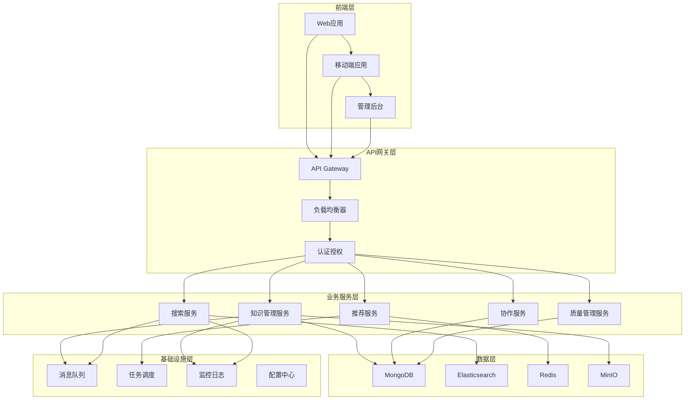
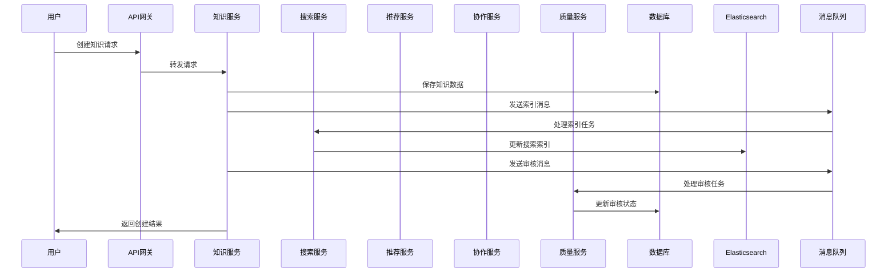

# 知识库管理详细设计

## 版本信息
- **版本号**: 1.0.0
- **最后更新**: 2024-01-15
- **作者**: SiCal架构团队
- **评审人**: 技术架构师
- **状态**: 草稿

## 更新日志
- v1.0.0 (2024-01-15): 初始版本，定义知识库管理详细设计

---

## 1. 系统架构设计

### 1.1 整体架构



### 1.2 微服务架构

#### 知识管理服务 (Knowledge Service)
- **职责**: 知识的CRUD操作、版本管理、分类管理
- **技术栈**: Node.js + Express + MongoDB
- **端口**: 3001
- **数据库**: knowledge_db

#### 搜索服务 (Search Service)
- **职责**: 全文搜索、智能推荐、搜索分析
- **技术栈**: Node.js + Express + Elasticsearch
- **端口**: 3002
- **数据库**: elasticsearch_cluster

#### 推荐服务 (Recommendation Service)
- **职责**: 个性化推荐、协同过滤、内容推荐
- **技术栈**: Python + FastAPI + Redis
- **端口**: 3003
- **数据库**: redis_cluster

#### 协作服务 (Collaboration Service)
- **职责**: 实时协作、版本控制、冲突解决
- **技术栈**: Node.js + Socket.io + MongoDB
- **端口**: 3004
- **数据库**: collaboration_db

#### 质量管理服务 (Quality Service)
- **职责**: 内容审核、质量评估、专家认证
- **技术栈**: Node.js + Express + MongoDB
- **端口**: 3005
- **数据库**: quality_db

### 1.3 数据流架构



## 2. 数据模型设计

### 2.1 知识实体模型

#### 知识条目 (Knowledge)
```javascript
{
  _id: ObjectId,
  title: String,                    // 知识标题
  summary: String,                  // 知识摘要
  content: {
    type: String,                   // 内容类型：text/html/markdown
    data: String,                   // 内容数据
    attachments: [{
      type: String,                 // 附件类型：image/video/audio/document
      url: String,                  // 附件URL
      name: String,                 // 附件名称
      size: Number,                 // 附件大小
      metadata: Object              // 附件元数据
    }]
  },
  category: {
    primary: String,                // 主分类
    secondary: String,              // 次分类
    tags: [String]                  // 标签列表
  },
  author: {
    userId: ObjectId,               // 作者ID
    name: String,                   // 作者姓名
    institution: String             // 作者机构
  },
  collaborators: [{
    userId: ObjectId,               // 协作者ID
    role: String,                   // 角色：editor/reviewer/viewer
    joinedAt: Date                  // 加入时间
  }],
  status: {
    current: String,                // 当前状态：draft/review/published/archived
    publishedAt: Date,              // 发布时间
    lastModified: Date              // 最后修改时间
  },
  quality: {
    score: Number,                  // 质量评分
    reviews: [{
      reviewerId: ObjectId,         // 评审者ID
      score: Number,                // 评分
      comment: String,              // 评论
      reviewedAt: Date              // 评审时间
    }],
    certifications: [{
      type: String,                 // 认证类型
      authority: String,            // 认证机构
      certifiedAt: Date            // 认证时间
    }]
  },
  statistics: {
    views: Number,                  // 浏览次数
    likes: Number,                  // 点赞数
    shares: Number,                 // 分享次数
    downloads: Number,              // 下载次数
    comments: Number                // 评论数
  },
  relations: {
    references: [ObjectId],         // 引用的知识
    citedBy: [ObjectId],           // 被引用的知识
    related: [ObjectId],           // 相关知识
    prerequisites: [ObjectId],      // 前置知识
    followups: [ObjectId]          // 后续知识
  },
  metadata: {
    keywords: [String],             // 关键词
    difficulty: String,             // 难度级别
    estimatedTime: Number,          // 预估学习时间
    language: String,               // 语言
    version: String,                // 版本号
    source: String                  // 来源
  },
  createdAt: Date,
  updatedAt: Date
}
```

#### 知识分类 (Category)
```javascript
{
  _id: ObjectId,
  name: String,                     // 分类名称
  code: String,                     // 分类编码
  description: String,              // 分类描述
  parent: ObjectId,                 // 父分类ID
  children: [ObjectId],             // 子分类ID列表
  level: Number,                    // 分类层级
  path: String,                     // 分类路径
  icon: String,                     // 分类图标
  color: String,                    // 分类颜色
  order: Number,                    // 排序权重
  isActive: Boolean,                // 是否启用
  metadata: {
    knowledgeCount: Number,         // 知识数量
    popularTags: [String],          // 热门标签
    experts: [ObjectId]             // 专家用户
  },
  createdAt: Date,
  updatedAt: Date
}
```

#### 知识版本 (KnowledgeVersion)
```javascript
{
  _id: ObjectId,
  knowledgeId: ObjectId,            // 知识ID
  version: String,                  // 版本号
  title: String,                    // 版本标题
  content: Object,                  // 版本内容
  changes: {
    type: String,                   // 变更类型：create/update/delete
    description: String,            // 变更描述
    diff: Object                    // 变更差异
  },
  author: {
    userId: ObjectId,               // 作者ID
    name: String                    // 作者姓名
  },
  status: String,                   // 版本状态：draft/published/archived
  parentVersion: String,            // 父版本号
  mergeInfo: {
    isMerged: Boolean,              // 是否已合并
    mergedAt: Date,                 // 合并时间
    mergedBy: ObjectId              // 合并者ID
  },
  createdAt: Date
}
```

### 2.2 搜索索引模型

#### Elasticsearch 索引结构
```json
{
  "mappings": {
    "properties": {
      "id": { "type": "keyword" },
      "title": {
        "type": "text",
        "analyzer": "ik_max_word",
        "fields": {
          "keyword": { "type": "keyword" },
          "suggest": {
            "type": "completion",
            "analyzer": "simple"
          }
        }
      },
      "summary": {
        "type": "text",
        "analyzer": "ik_max_word"
      },
      "content": {
        "type": "text",
        "analyzer": "ik_max_word"
      },
      "category": {
        "type": "object",
        "properties": {
          "primary": { "type": "keyword" },
          "secondary": { "type": "keyword" },
          "tags": { "type": "keyword" }
        }
      },
      "author": {
        "type": "object",
        "properties": {
          "userId": { "type": "keyword" },
          "name": {
            "type": "text",
            "analyzer": "ik_max_word",
            "fields": {
              "keyword": { "type": "keyword" }
            }
          },
          "institution": { "type": "keyword" }
        }
      },
      "status": {
        "type": "object",
        "properties": {
          "current": { "type": "keyword" },
          "publishedAt": { "type": "date" },
          "lastModified": { "type": "date" }
        }
      },
      "quality": {
        "type": "object",
        "properties": {
          "score": { "type": "float" }
        }
      },
      "statistics": {
        "type": "object",
        "properties": {
          "views": { "type": "integer" },
          "likes": { "type": "integer" },
          "shares": { "type": "integer" }
        }
      },
      "metadata": {
        "type": "object",
        "properties": {
          "keywords": { "type": "keyword" },
          "difficulty": { "type": "keyword" },
          "estimatedTime": { "type": "integer" },
          "language": { "type": "keyword" }
        }
      },
      "createdAt": { "type": "date" },
      "updatedAt": { "type": "date" }
    }
  },
  "settings": {
    "analysis": {
      "analyzer": {
        "ik_max_word": {
          "type": "ik_max_word"
        }
      }
    }
  }
}
```

## 3. 核心业务逻辑设计

### 3.1 知识管理逻辑

#### 知识创建流程
```javascript
class KnowledgeService {
  async createKnowledge(knowledgeData, userId) {
    // 1. 数据验证
    const validatedData = await this.validateKnowledgeData(knowledgeData);
    
    // 2. 处理附件上传
    const processedAttachments = await this.processAttachments(validatedData.attachments);
    
    // 3. 创建知识记录
    const knowledge = await Knowledge.create({
      ...validatedData,
      content: {
        ...validatedData.content,
        attachments: processedAttachments
      },
      author: {
        userId,
        name: await this.getUserName(userId),
        institution: await this.getUserInstitution(userId)
      },
      status: {
        current: 'draft',
        lastModified: new Date()
      },
      statistics: {
        views: 0,
        likes: 0,
        shares: 0,
        downloads: 0,
        comments: 0
      },
      createdAt: new Date(),
      updatedAt: new Date()
    });
    
    // 4. 创建初始版本
    await this.createVersion(knowledge._id, knowledge, userId, 'create', '初始创建');
    
    // 5. 发送索引消息
    await this.messageQueue.publish('knowledge.created', {
      knowledgeId: knowledge._id,
      data: knowledge
    });
    
    // 6. 发送审核消息（如果需要）
    if (this.requiresReview(knowledge)) {
      await this.messageQueue.publish('knowledge.review', {
        knowledgeId: knowledge._id,
        authorId: userId
      });
    }
    
    return knowledge;
  }
  
  async updateKnowledge(knowledgeId, updateData, userId) {
    // 1. 检查权限
    await this.checkUpdatePermission(knowledgeId, userId);
    
    // 2. 获取当前版本
    const currentKnowledge = await Knowledge.findById(knowledgeId);
    
    // 3. 计算变更差异
    const diff = this.calculateDiff(currentKnowledge, updateData);
    
    // 4. 更新知识
    const updatedKnowledge = await Knowledge.findByIdAndUpdate(
      knowledgeId,
      {
        ...updateData,
        'status.lastModified': new Date(),
        updatedAt: new Date()
      },
      { new: true }
    );
    
    // 5. 创建新版本
    await this.createVersion(
      knowledgeId,
      updatedKnowledge,
      userId,
      'update',
      updateData.changeDescription || '内容更新',
      diff
    );
    
    // 6. 发送更新消息
    await this.messageQueue.publish('knowledge.updated', {
      knowledgeId,
      data: updatedKnowledge,
      diff
    });
    
    return updatedKnowledge;
  }
}
```

#### 版本管理逻辑
```javascript
class VersionService {
  async createVersion(knowledgeId, content, userId, changeType, description, diff = null) {
    // 1. 生成版本号
    const version = await this.generateVersionNumber(knowledgeId, changeType);
    
    // 2. 创建版本记录
    const versionRecord = await KnowledgeVersion.create({
      knowledgeId,
      version,
      title: content.title,
      content: this.sanitizeContent(content),
      changes: {
        type: changeType,
        description,
        diff
      },
      author: {
        userId,
        name: await this.getUserName(userId)
      },
      status: 'published',
      parentVersion: await this.getLatestVersion(knowledgeId),
      createdAt: new Date()
    });
    
    return versionRecord;
  }
  
  async compareVersions(knowledgeId, version1, version2) {
    const [v1, v2] = await Promise.all([
      KnowledgeVersion.findOne({ knowledgeId, version: version1 }),
      KnowledgeVersion.findOne({ knowledgeId, version: version2 })
    ]);
    
    if (!v1 || !v2) {
      throw new Error('版本不存在');
    }
    
    return {
      version1: v1,
      version2: v2,
      diff: this.calculateDetailedDiff(v1.content, v2.content)
    };
  }
  
  async rollbackToVersion(knowledgeId, targetVersion, userId) {
    // 1. 检查权限
    await this.checkRollbackPermission(knowledgeId, userId);
    
    // 2. 获取目标版本
    const targetVersionData = await KnowledgeVersion.findOne({
      knowledgeId,
      version: targetVersion
    });
    
    if (!targetVersionData) {
      throw new Error('目标版本不存在');
    }
    
    // 3. 回滚知识内容
    const rolledBackKnowledge = await Knowledge.findByIdAndUpdate(
      knowledgeId,
      {
        ...targetVersionData.content,
        'status.lastModified': new Date(),
        updatedAt: new Date()
      },
      { new: true }
    );
    
    // 4. 创建回滚版本
    await this.createVersion(
      knowledgeId,
      rolledBackKnowledge,
      userId,
      'rollback',
      `回滚到版本 ${targetVersion}`
    );
    
    return rolledBackKnowledge;
  }
}
```

### 3.2 搜索逻辑设计

#### 智能搜索实现
```javascript
class SearchService {
  async search(query, options = {}) {
    const {
      page = 1,
      size = 20,
      category,
      difficulty,
      author,
      dateRange,
      sortBy = 'relevance',
      userId
    } = options;
    
    // 1. 构建搜索查询
    const searchQuery = this.buildSearchQuery(query, {
      category,
      difficulty,
      author,
      dateRange
    });
    
    // 2. 执行搜索
    const searchResult = await this.elasticsearch.search({
      index: 'knowledge',
      body: {
        query: searchQuery,
        sort: this.buildSortQuery(sortBy),
        highlight: {
          fields: {
            title: {},
            summary: {},
            content: {
              fragment_size: 150,
              number_of_fragments: 3
            }
          }
        },
        aggs: {
          categories: {
            terms: { field: 'category.primary' }
          },
          authors: {
            terms: { field: 'author.name.keyword' }
          },
          difficulties: {
            terms: { field: 'metadata.difficulty' }
          }
        },
        from: (page - 1) * size,
        size
      }
    });
    
    // 3. 处理搜索结果
    const processedResults = await this.processSearchResults(
      searchResult,
      userId
    );
    
    // 4. 记录搜索行为
    await this.recordSearchBehavior(userId, query, processedResults.total);
    
    return processedResults;
  }
  
  buildSearchQuery(query, filters) {
    const must = [];
    const filter = [];
    
    // 主查询
    if (query) {
      must.push({
        multi_match: {
          query,
          fields: [
            'title^3',
            'summary^2',
            'content',
            'category.tags',
            'metadata.keywords'
          ],
          type: 'best_fields',
          fuzziness: 'AUTO'
        }
      });
    } else {
      must.push({ match_all: {} });
    }
    
    // 状态过滤
    filter.push({
      term: { 'status.current': 'published' }
    });
    
    // 分类过滤
    if (filters.category) {
      filter.push({
        term: { 'category.primary': filters.category }
      });
    }
    
    // 难度过滤
    if (filters.difficulty) {
      filter.push({
        term: { 'metadata.difficulty': filters.difficulty }
      });
    }
    
    // 作者过滤
    if (filters.author) {
      filter.push({
        term: { 'author.userId': filters.author }
      });
    }
    
    // 时间范围过滤
    if (filters.dateRange) {
      filter.push({
        range: {
          'status.publishedAt': {
            gte: filters.dateRange.start,
            lte: filters.dateRange.end
          }
        }
      });
    }
    
    return {
      bool: {
        must,
        filter
      }
    };
  }
  
  async getSuggestions(query, limit = 10) {
    const suggestions = await this.elasticsearch.search({
      index: 'knowledge',
      body: {
        suggest: {
          title_suggest: {
            prefix: query,
            completion: {
              field: 'title.suggest',
              size: limit
            }
          }
        }
      }
    });
    
    return suggestions.body.suggest.title_suggest[0].options.map(
      option => option.text
    );
  }
}
```

### 3.3 推荐算法设计

#### 个性化推荐实现
```python
class RecommendationService:
    def __init__(self):
        self.redis_client = redis.Redis()
        self.knowledge_service = KnowledgeService()
        self.user_service = UserService()
    
    async def get_recommendations(self, user_id: str, limit: int = 10) -> List[Dict]:
        """获取个性化推荐"""
        # 1. 获取用户画像
        user_profile = await self.get_user_profile(user_id)
        
        # 2. 获取候选知识集合
        candidates = await self.get_candidate_knowledge(user_profile)
        
        # 3. 计算推荐分数
        scored_candidates = await self.score_candidates(
            user_id, candidates, user_profile
        )
        
        # 4. 排序和过滤
        recommendations = self.rank_and_filter(
            scored_candidates, limit
        )
        
        # 5. 缓存推荐结果
        await self.cache_recommendations(user_id, recommendations)
        
        return recommendations
    
    async def score_candidates(self, user_id: str, candidates: List[Dict], 
                             user_profile: Dict) -> List[Dict]:
        """计算候选知识的推荐分数"""
        scored_candidates = []
        
        for candidate in candidates:
            score = 0.0
            
            # 内容相似度分数 (40%)
            content_score = await self.calculate_content_similarity(
                candidate, user_profile['interests']
            )
            score += content_score * 0.4
            
            # 协同过滤分数 (30%)
            cf_score = await self.calculate_collaborative_filtering_score(
                user_id, candidate['id']
            )
            score += cf_score * 0.3
            
            # 热度分数 (20%)
            popularity_score = self.calculate_popularity_score(candidate)
            score += popularity_score * 0.2
            
            # 新鲜度分数 (10%)
            freshness_score = self.calculate_freshness_score(candidate)
            score += freshness_score * 0.1
            
            scored_candidates.append({
                **candidate,
                'recommendation_score': score,
                'score_breakdown': {
                    'content': content_score,
                    'collaborative': cf_score,
                    'popularity': popularity_score,
                    'freshness': freshness_score
                }
            })
        
        return scored_candidates
    
    async def calculate_content_similarity(self, candidate: Dict, 
                                         user_interests: List[str]) -> float:
        """计算内容相似度"""
        candidate_tags = candidate.get('category', {}).get('tags', [])
        candidate_keywords = candidate.get('metadata', {}).get('keywords', [])
        candidate_features = candidate_tags + candidate_keywords
        
        if not candidate_features or not user_interests:
            return 0.0
        
        # 使用Jaccard相似度
        intersection = len(set(candidate_features) & set(user_interests))
        union = len(set(candidate_features) | set(user_interests))
        
        return intersection / union if union > 0 else 0.0
    
    async def calculate_collaborative_filtering_score(self, user_id: str, 
                                                    knowledge_id: str) -> float:
        """计算协同过滤分数"""
        # 获取相似用户
        similar_users = await self.get_similar_users(user_id)
        
        if not similar_users:
            return 0.0
        
        total_score = 0.0
        total_weight = 0.0
        
        for similar_user in similar_users:
            # 获取相似用户对该知识的评分
            rating = await self.get_user_knowledge_rating(
                similar_user['user_id'], knowledge_id
            )
            
            if rating > 0:
                weight = similar_user['similarity']
                total_score += rating * weight
                total_weight += weight
        
        return total_score / total_weight if total_weight > 0 else 0.0
```

### 3.4 协作逻辑设计

#### 实时协作实现
```javascript
class CollaborationService {
  constructor() {
    this.io = require('socket.io')(server);
    this.activeCollaborations = new Map();
    this.setupSocketHandlers();
  }
  
  setupSocketHandlers() {
    this.io.on('connection', (socket) => {
      socket.on('join-collaboration', async (data) => {
        await this.handleJoinCollaboration(socket, data);
      });
      
      socket.on('content-change', async (data) => {
        await this.handleContentChange(socket, data);
      });
      
      socket.on('cursor-position', async (data) => {
        await this.handleCursorPosition(socket, data);
      });
      
      socket.on('leave-collaboration', async (data) => {
        await this.handleLeaveCollaboration(socket, data);
      });
      
      socket.on('disconnect', () => {
        this.handleDisconnect(socket);
      });
    });
  }
  
  async handleJoinCollaboration(socket, { knowledgeId, userId }) {
    // 1. 验证权限
    const hasPermission = await this.checkCollaborationPermission(
      knowledgeId, userId
    );
    
    if (!hasPermission) {
      socket.emit('error', { message: '无协作权限' });
      return;
    }
    
    // 2. 加入协作房间
    socket.join(`knowledge-${knowledgeId}`);
    
    // 3. 记录活跃协作者
    if (!this.activeCollaborations.has(knowledgeId)) {
      this.activeCollaborations.set(knowledgeId, new Map());
    }
    
    const collaborators = this.activeCollaborations.get(knowledgeId);
    collaborators.set(userId, {
      socketId: socket.id,
      userId,
      joinedAt: new Date(),
      lastActivity: new Date()
    });
    
    // 4. 获取当前文档状态
    const currentState = await this.getCurrentDocumentState(knowledgeId);
    
    // 5. 发送当前状态给新加入的用户
    socket.emit('collaboration-state', {
      knowledgeId,
      content: currentState.content,
      collaborators: Array.from(collaborators.values()),
      version: currentState.version
    });
    
    // 6. 通知其他协作者
    socket.to(`knowledge-${knowledgeId}`).emit('collaborator-joined', {
      userId,
      user: await this.getUserInfo(userId)
    });
  }
  
  async handleContentChange(socket, { knowledgeId, operation, userId }) {
    try {
      // 1. 验证操作
      const isValidOperation = await this.validateOperation(
        knowledgeId, operation, userId
      );
      
      if (!isValidOperation) {
        socket.emit('operation-rejected', { operation });
        return;
      }
      
      // 2. 应用操作变换
      const transformedOperation = await this.transformOperation(
        knowledgeId, operation
      );
      
      // 3. 更新文档状态
      await this.applyOperation(knowledgeId, transformedOperation);
      
      // 4. 广播操作给其他协作者
      socket.to(`knowledge-${knowledgeId}`).emit('operation-applied', {
        operation: transformedOperation,
        userId
      });
      
      // 5. 确认操作成功
      socket.emit('operation-acknowledged', {
        operationId: operation.id,
        transformedOperation
      });
      
      // 6. 更新活跃时间
      this.updateCollaboratorActivity(knowledgeId, userId);
      
    } catch (error) {
      socket.emit('operation-error', {
        operationId: operation.id,
        error: error.message
      });
    }
  }
  
  async transformOperation(knowledgeId, operation) {
    // 获取当前文档状态
    const currentState = await this.getCurrentDocumentState(knowledgeId);
    
    // 获取未确认的操作
    const pendingOperations = await this.getPendingOperations(
      knowledgeId, operation.baseVersion
    );
    
    // 应用操作变换算法 (Operational Transformation)
    let transformedOp = operation;
    
    for (const pendingOp of pendingOperations) {
      transformedOp = this.operationalTransform(transformedOp, pendingOp);
    }
    
    return transformedOp;
  }
  
  operationalTransform(op1, op2) {
    // 简化的操作变换实现
    // 实际实现需要根据具体的操作类型进行复杂的变换
    
    if (op1.type === 'insert' && op2.type === 'insert') {
      if (op1.position <= op2.position) {
        return {
          ...op2,
          position: op2.position + op1.content.length
        };
      }
    }
    
    if (op1.type === 'delete' && op2.type === 'insert') {
      if (op1.position < op2.position) {
        return {
          ...op2,
          position: op2.position - op1.length
        };
      }
    }
    
    // 更多变换规则...
    
    return op2;
  }
}
```

## 4. 接口设计

### 4.1 RESTful API 设计

#### 知识管理接口
```javascript
// 创建知识
POST /api/knowledge
Content-Type: application/json
Authorization: Bearer <token>

{
  "title": "心脏解剖学基础",
  "summary": "介绍心脏的基本解剖结构",
  "content": {
    "type": "html",
    "data": "<h1>心脏解剖学</h1><p>心脏是...</p>"
  },
  "category": {
    "primary": "解剖学",
    "secondary": "心血管系统",
    "tags": ["心脏", "解剖", "基础"]
  },
  "metadata": {
    "difficulty": "beginner",
    "estimatedTime": 30,
    "keywords": ["心脏", "解剖学", "心房", "心室"]
  }
}

// 响应
{
  "success": true,
  "data": {
    "id": "507f1f77bcf86cd799439011",
    "title": "心脏解剖学基础",
    "status": {
      "current": "draft",
      "lastModified": "2024-01-15T10:30:00Z"
    },
    "version": "1.0.0",
    "createdAt": "2024-01-15T10:30:00Z"
  }
}

// 获取知识详情
GET /api/knowledge/:id
Authorization: Bearer <token>

// 响应
{
  "success": true,
  "data": {
    "id": "507f1f77bcf86cd799439011",
    "title": "心脏解剖学基础",
    "summary": "介绍心脏的基本解剖结构",
    "content": {
      "type": "html",
      "data": "<h1>心脏解剖学</h1>...",
      "attachments": [
        {
          "type": "image",
          "url": "/files/heart-anatomy.jpg",
          "name": "心脏解剖图",
          "size": 1024000
        }
      ]
    },
    "category": {
      "primary": "解剖学",
      "secondary": "心血管系统",
      "tags": ["心脏", "解剖", "基础"]
    },
    "author": {
      "userId": "507f1f77bcf86cd799439012",
      "name": "张教授",
      "institution": "北京大学医学部"
    },
    "quality": {
      "score": 4.5,
      "reviews": [
        {
          "reviewerId": "507f1f77bcf86cd799439013",
          "score": 5,
          "comment": "内容详实，图文并茂",
          "reviewedAt": "2024-01-15T11:00:00Z"
        }
      ]
    },
    "statistics": {
      "views": 1250,
      "likes": 89,
      "shares": 23,
      "comments": 15
    },
    "relations": {
      "related": [
        {
          "id": "507f1f77bcf86cd799439014",
          "title": "心脏生理学",
          "similarity": 0.85
        }
      ]
    },
    "createdAt": "2024-01-15T10:30:00Z",
    "updatedAt": "2024-01-15T12:00:00Z"
  }
}
```

#### 搜索接口
```javascript
// 搜索知识
GET /api/search?q=心脏&category=解剖学&page=1&size=20&sort=relevance
Authorization: Bearer <token>

// 响应
{
  "success": true,
  "data": {
    "total": 156,
    "page": 1,
    "size": 20,
    "results": [
      {
        "id": "507f1f77bcf86cd799439011",
        "title": "心脏解剖学基础",
        "summary": "介绍心脏的基本解剖结构",
        "highlights": {
          "title": ["<em>心脏</em>解剖学基础"],
          "content": ["<em>心脏</em>是人体最重要的器官之一..."]
        },
        "score": 0.95,
        "category": {
          "primary": "解剖学",
          "tags": ["心脏", "解剖"]
        },
        "author": {
          "name": "张教授",
          "institution": "北京大学医学部"
        },
        "statistics": {
          "views": 1250,
          "likes": 89
        },
        "publishedAt": "2024-01-15T10:30:00Z"
      }
    ],
    "aggregations": {
      "categories": [
        { "key": "解剖学", "count": 45 },
        { "key": "生理学", "count": 32 }
      ],
      "authors": [
        { "key": "张教授", "count": 12 },
        { "key": "李教授", "count": 8 }
      ]
    }
  }
}

// 搜索建议
GET /api/search/suggestions?q=心脏
Authorization: Bearer <token>

// 响应
{
  "success": true,
  "data": {
    "suggestions": [
      "心脏解剖学",
      "心脏生理学",
      "心脏病理学",
      "心脏超声",
      "心脏手术"
    ]
  }
}
```

### 4.2 WebSocket 接口设计

#### 协作编辑接口
```javascript
// 客户端连接
const socket = io('/collaboration');

// 加入协作
socket.emit('join-collaboration', {
  knowledgeId: '507f1f77bcf86cd799439011',
  userId: '507f1f77bcf86cd799439012'
});

// 监听协作状态
socket.on('collaboration-state', (data) => {
  console.log('当前协作状态:', data);
  // {
  //   knowledgeId: '507f1f77bcf86cd799439011',
  //   content: { ... },
  //   collaborators: [
  //     {
  //       userId: '507f1f77bcf86cd799439012',
  //       socketId: 'abc123',
  //       joinedAt: '2024-01-15T10:30:00Z'
  //     }
  //   ],
  //   version: '1.2.3'
  // }
});

// 发送内容变更
socket.emit('content-change', {
  knowledgeId: '507f1f77bcf86cd799439011',
  operation: {
    id: 'op-123',
    type: 'insert',
    position: 100,
    content: '新增的文本内容',
    baseVersion: '1.2.3'
  },
  userId: '507f1f77bcf86cd799439012'
});

// 监听操作应用
socket.on('operation-applied', (data) => {
  console.log('操作已应用:', data);
  // {
  //   operation: { ... },
  //   userId: '507f1f77bcf86cd799439013'
  // }
});

// 发送光标位置
socket.emit('cursor-position', {
  knowledgeId: '507f1f77bcf86cd799439011',
  position: 150,
  selection: { start: 150, end: 160 },
  userId: '507f1f77bcf86cd799439012'
});

// 监听其他用户光标
socket.on('cursor-update', (data) => {
  console.log('用户光标更新:', data);
  // {
  //   userId: '507f1f77bcf86cd799439013',
  //   position: 200,
  //   selection: { start: 200, end: 210 }
  // }
});
```

## 5. 缓存策略设计

### 5.1 多级缓存架构

```javascript
class CacheManager {
  constructor() {
    this.localCache = new NodeCache({ stdTTL: 300 }); // 5分钟
    this.redisCache = new Redis({
      host: 'redis-cluster',
      port: 6379,
      retryDelayOnFailover: 100
    });
  }
  
  async get(key, options = {}) {
    const { useLocal = true, useRedis = true, fallback } = options;
    
    // 1. 尝试本地缓存
    if (useLocal) {
      const localValue = this.localCache.get(key);
      if (localValue !== undefined) {
        return localValue;
      }
    }
    
    // 2. 尝试Redis缓存
    if (useRedis) {
      const redisValue = await this.redisCache.get(key);
      if (redisValue) {
        const parsedValue = JSON.parse(redisValue);
        // 回填本地缓存
        if (useLocal) {
          this.localCache.set(key, parsedValue);
        }
        return parsedValue;
      }
    }
    
    // 3. 执行回退函数
    if (fallback && typeof fallback === 'function') {
      const value = await fallback();
      if (value !== undefined) {
        await this.set(key, value, options);
        return value;
      }
    }
    
    return null;
  }
  
  async set(key, value, options = {}) {
    const { 
      localTTL = 300, 
      redisTTL = 1800, 
      useLocal = true, 
      useRedis = true 
    } = options;
    
    // 设置本地缓存
    if (useLocal) {
      this.localCache.set(key, value, localTTL);
    }
    
    // 设置Redis缓存
    if (useRedis) {
      await this.redisCache.setex(
        key, 
        redisTTL, 
        JSON.stringify(value)
      );
    }
  }
  
  async invalidate(pattern) {
    // 清除本地缓存
    const localKeys = this.localCache.keys();
    localKeys.forEach(key => {
      if (key.match(pattern)) {
        this.localCache.del(key);
      }
    });
    
    // 清除Redis缓存
    const redisKeys = await this.redisCache.keys(pattern);
    if (redisKeys.length > 0) {
      await this.redisCache.del(...redisKeys);
    }
  }
}
```

### 5.2 缓存策略配置

```javascript
const cacheStrategies = {
  // 知识详情缓存
  knowledge: {
    key: (id) => `knowledge:${id}`,
    localTTL: 300,    // 5分钟
    redisTTL: 1800,   // 30分钟
    invalidateOn: ['knowledge.updated', 'knowledge.deleted']
  },
  
  // 搜索结果缓存
  search: {
    key: (query, filters) => `search:${hashObject({ query, filters })}`,
    localTTL: 180,    // 3分钟
    redisTTL: 600,    // 10分钟
    invalidateOn: ['knowledge.created', 'knowledge.updated']
  },
  
  // 用户推荐缓存
  recommendations: {
    key: (userId) => `recommendations:${userId}`,
    localTTL: 0,      // 不使用本地缓存
    redisTTL: 3600,   // 1小时
    invalidateOn: ['user.behavior', 'knowledge.created']
  },
  
  // 分类树缓存
  categories: {
    key: () => 'categories:tree',
    localTTL: 1800,   // 30分钟
    redisTTL: 7200,   // 2小时
    invalidateOn: ['category.updated']
  }
};
```

## 6. 监控和日志设计

### 6.1 性能监控

```javascript
class PerformanceMonitor {
  constructor() {
    this.metrics = {
      requests: new Map(),
      database: new Map(),
      cache: new Map(),
      search: new Map()
    };
  }
  
  // API请求监控
  trackRequest(req, res, next) {
    const startTime = Date.now();
    const requestId = req.headers['x-request-id'] || generateId();
    
    res.on('finish', () => {
      const duration = Date.now() - startTime;
      const metric = {
        requestId,
        method: req.method,
        url: req.url,
        statusCode: res.statusCode,
        duration,
        userAgent: req.headers['user-agent'],
        ip: req.ip,
        timestamp: new Date()
      };
      
      this.recordMetric('requests', metric);
      
      // 慢请求告警
      if (duration > 5000) {
        this.sendAlert('slow_request', metric);
      }
    });
    
    next();
  }
  
  // 数据库查询监控
  trackDatabaseQuery(operation, collection, query, duration) {
    const metric = {
      operation,
      collection,
      query: this.sanitizeQuery(query),
      duration,
      timestamp: new Date()
    };
    
    this.recordMetric('database', metric);
    
    // 慢查询告警
    if (duration > 1000) {
      this.sendAlert('slow_query', metric);
    }
  }
  
  // 缓存命中率监控
  trackCacheHit(key, hit) {
    const metric = {
      key,
      hit,
      timestamp: new Date()
    };
    
    this.recordMetric('cache', metric);
  }
  
  // 搜索性能监控
  trackSearchQuery(query, resultCount, duration) {
    const metric = {
      query,
      resultCount,
      duration,
      timestamp: new Date()
    };
    
    this.recordMetric('search', metric);
  }
  
  // 生成性能报告
  generateReport(timeRange) {
    const report = {
      requests: this.analyzeRequests(timeRange),
      database: this.analyzeDatabase(timeRange),
      cache: this.analyzeCache(timeRange),
      search: this.analyzeSearch(timeRange)
    };
    
    return report;
  }
}
```

### 6.2 业务日志设计

```javascript
class BusinessLogger {
  constructor() {
    this.winston = require('winston');
    this.logger = this.winston.createLogger({
      level: 'info',
      format: this.winston.format.combine(
        this.winston.format.timestamp(),
        this.winston.format.errors({ stack: true }),
        this.winston.format.json()
      ),
      transports: [
        new this.winston.transports.File({ 
          filename: 'logs/error.log', 
          level: 'error' 
        }),
        new this.winston.transports.File({ 
          filename: 'logs/business.log' 
        }),
        new this.winston.transports.Console({
          format: this.winston.format.simple()
        })
      ]
    });
  }
  
  // 知识操作日志
  logKnowledgeOperation(operation, knowledgeId, userId, details = {}) {
    this.logger.info('Knowledge Operation', {
      operation,
      knowledgeId,
      userId,
      details,
      timestamp: new Date(),
      category: 'knowledge'
    });
  }
  
  // 搜索行为日志
  logSearchBehavior(userId, query, resultCount, clickedResults = []) {
    this.logger.info('Search Behavior', {
      userId,
      query,
      resultCount,
      clickedResults,
      timestamp: new Date(),
      category: 'search'
    });
  }
  
  // 用户行为日志
  logUserBehavior(userId, action, target, context = {}) {
    this.logger.info('User Behavior', {
      userId,
      action,
      target,
      context,
      timestamp: new Date(),
      category: 'user_behavior'
    });
  }
  
  // 系统错误日志
  logError(error, context = {}) {
    this.logger.error('System Error', {
      message: error.message,
      stack: error.stack,
      context,
      timestamp: new Date(),
      category: 'error'
    });
  }
}
```

---

本设计文档详细定义了知识库管理系统的技术架构、数据模型、业务逻辑、接口设计等各个方面，为开发团队提供了全面的技术指导。