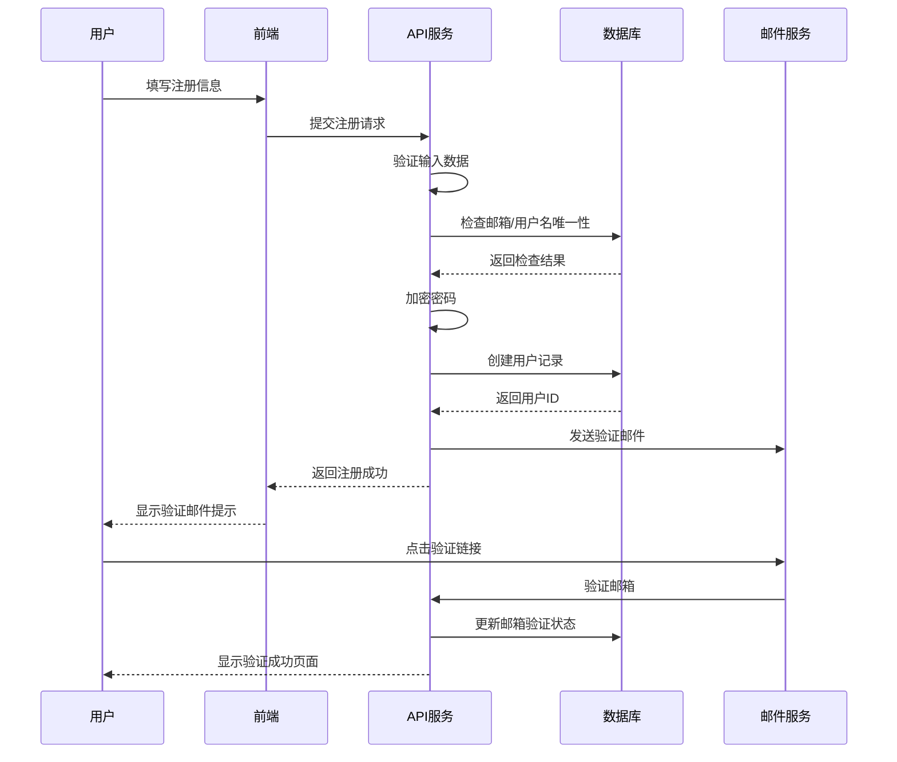
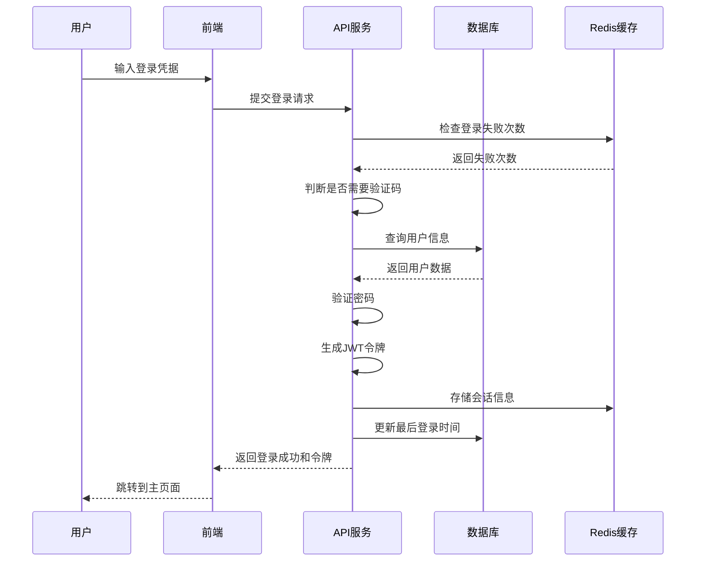
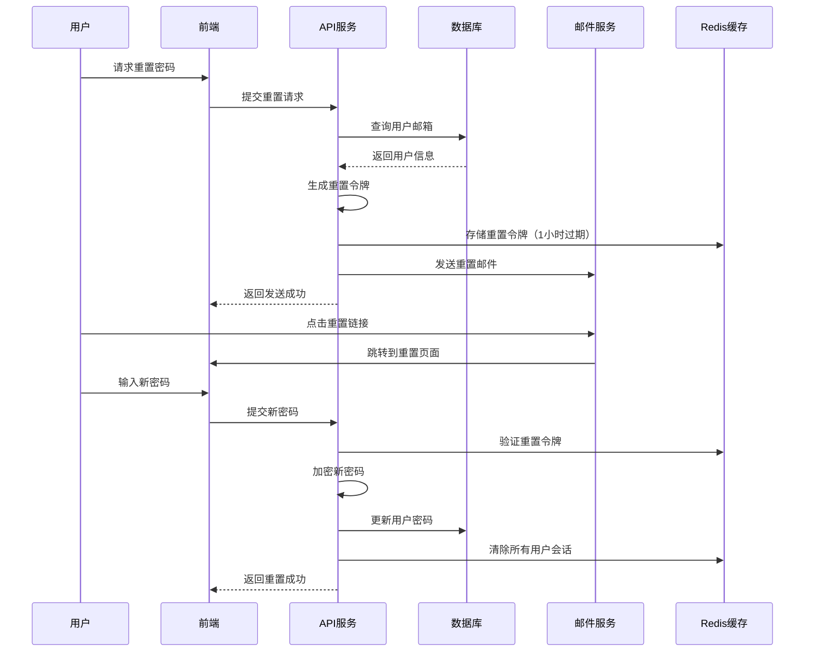

# 用户管理详细设计

## 版本信息
- **版本号**: 1.0.0
- **最后更新**: 2024-01-15
- **作者**: SiCal开发团队
- **评审人**: 技术架构师
- **状态**: 草稿

## 更新日志
- v1.0.0 (2024-01-15): 初始版本，定义用户管理详细设计

---

## 1. 系统架构设计

### 1.1 整体架构
```
┌─────────────────┐    ┌─────────────────┐    ┌─────────────────┐
│   前端应用      │    │   API网关       │    │   用户服务      │
│   (React)       │◄──►│   (Express)     │◄──►│   (Node.js)     │
└─────────────────┘    └─────────────────┘    └─────────────────┘
                                                        │
                                                        ▼
┌─────────────────┐    ┌─────────────────┐    ┌─────────────────┐
│   缓存层        │    │   消息队列      │    │   数据库        │
│   (Redis)       │    │   (Redis)       │    │   (MongoDB)     │
└─────────────────┘    └─────────────────┘    └─────────────────┘
```

### 1.2 模块划分
- **认证模块**: 负责用户登录、注册、密码管理
- **授权模块**: 负责权限控制和角色管理
- **用户信息模块**: 负责用户资料管理
- **会话管理模块**: 负责用户会话和状态管理
- **安全模块**: 负责安全策略和审计

## 2. 数据模型设计

### 2.1 用户基础信息模型
```javascript
// User Schema
{
  _id: ObjectId,
  email: String,           // 邮箱（唯一）
  username: String,        // 用户名（唯一）
  password: String,        // 加密密码
  profile: {
    realName: String,      // 真实姓名
    nickname: String,      // 昵称
    avatar: String,        // 头像URL
    gender: String,        // 性别
    birthday: Date,        // 生日
    phone: String,         // 手机号
    institution: String,   // 所属机构
    major: String,         // 专业方向
    studyStage: String,    // 学习阶段
    bio: String           // 个人简介
  },
  role: String,           // 用户角色
  status: String,         // 账户状态
  emailVerified: Boolean, // 邮箱验证状态
  phoneVerified: Boolean, // 手机验证状态
  lastLoginAt: Date,      // 最后登录时间
  lastActiveAt: Date,     // 最后活跃时间
  loginCount: Number,     // 登录次数
  createdAt: Date,        // 创建时间
  updatedAt: Date         // 更新时间
}
```

### 2.2 用户会话模型
```javascript
// Session Schema
{
  _id: ObjectId,
  userId: ObjectId,       // 用户ID
  token: String,          // 会话令牌
  refreshToken: String,   // 刷新令牌
  deviceInfo: {
    userAgent: String,    // 用户代理
    ip: String,          // IP地址
    location: String,    // 地理位置
    deviceType: String   // 设备类型
  },
  isActive: Boolean,      // 是否活跃
  expiresAt: Date,       // 过期时间
  createdAt: Date        // 创建时间
}
```

### 2.3 用户权限模型
```javascript
// Role Schema
{
  _id: ObjectId,
  name: String,           // 角色名称
  displayName: String,    // 显示名称
  description: String,    // 角色描述
  permissions: [String],  // 权限列表
  isSystem: Boolean,      // 是否系统角色
  createdAt: Date,
  updatedAt: Date
}

// Permission Schema
{
  _id: ObjectId,
  name: String,           // 权限名称
  resource: String,       // 资源名称
  action: String,         // 操作类型
  description: String,    // 权限描述
  category: String        // 权限分类
}
```

### 2.4 安全审计模型
```javascript
// AuditLog Schema
{
  _id: ObjectId,
  userId: ObjectId,       // 用户ID
  action: String,         // 操作类型
  resource: String,       // 操作资源
  details: Object,        // 操作详情
  ip: String,            // IP地址
  userAgent: String,     // 用户代理
  result: String,        // 操作结果
  timestamp: Date        // 时间戳
}
```

## 3. 核心业务流程设计

### 3.1 用户注册流程


### 3.2 用户登录流程


### 3.3 密码重置流程


## 4. 安全设计

### 4.1 密码安全
- **加密算法**: 使用bcrypt进行密码哈希
- **盐值**: 每个密码使用唯一盐值
- **强度要求**: 8-20位，包含大小写字母、数字、特殊字符
- **历史记录**: 保存最近5次密码哈希，防止重复使用

### 4.2 会话安全
- **JWT令牌**: 使用RS256算法签名
- **令牌过期**: 访问令牌15分钟，刷新令牌7天
- **令牌刷新**: 自动刷新机制，无感知续期
- **设备绑定**: 令牌与设备信息绑定

### 4.3 防护机制
- **登录限制**: 5次失败后锁定30分钟
- **验证码**: 连续失败3次后启用图形验证码
- **IP限制**: 异常IP访问检测和限制
- **设备检测**: 新设备登录邮件通知

### 4.4 数据保护
- **敏感数据加密**: 手机号、身份证等敏感信息加密存储
- **数据脱敏**: 日志中敏感信息脱敏处理
- **访问控制**: 基于角色的细粒度权限控制
- **审计日志**: 完整的用户操作审计记录

## 5. API接口设计

### 5.1 认证相关接口
```javascript
// 用户注册
POST /api/auth/register
{
  "email": "user@example.com",
  "username": "username",
  "password": "password123",
  "realName": "张三",
  "userType": "student"
}

// 用户登录
POST /api/auth/login
{
  "email": "user@example.com",
  "password": "password123",
  "rememberMe": true
}

// 刷新令牌
POST /api/auth/refresh
{
  "refreshToken": "refresh_token_here"
}

// 用户登出
POST /api/auth/logout
// Headers: Authorization: Bearer <token>

// 密码重置请求
POST /api/auth/forgot-password
{
  "email": "user@example.com"
}

// 密码重置确认
POST /api/auth/reset-password
{
  "token": "reset_token",
  "newPassword": "newpassword123"
}
```

### 5.2 用户信息接口
```javascript
// 获取用户信息
GET /api/users/profile
// Headers: Authorization: Bearer <token>

// 更新用户信息
PUT /api/users/profile
{
  "nickname": "新昵称",
  "bio": "个人简介",
  "institution": "某某大学"
}

// 上传头像
POST /api/users/avatar
// Content-Type: multipart/form-data
// Body: avatar file

// 修改密码
PUT /api/users/password
{
  "currentPassword": "oldpassword",
  "newPassword": "newpassword123"
}
```

### 5.3 管理员接口
```javascript
// 获取用户列表
GET /api/admin/users?page=1&limit=20&role=student

// 更新用户状态
PUT /api/admin/users/:userId/status
{
  "status": "active|locked|disabled"
}

// 分配用户角色
PUT /api/admin/users/:userId/role
{
  "role": "student|teacher|admin"
}
```

## 6. 缓存策略

### 6.1 用户信息缓存
- **缓存键**: `user:profile:{userId}`
- **过期时间**: 30分钟
- **更新策略**: 用户信息修改时主动更新

### 6.2 会话缓存
- **缓存键**: `session:{token}`
- **过期时间**: 与令牌过期时间一致
- **清理策略**: 用户登出时主动清理

### 6.3 权限缓存
- **缓存键**: `permissions:{userId}`
- **过期时间**: 1小时
- **更新策略**: 角色权限变更时清理相关缓存

## 7. 性能优化

### 7.1 数据库优化
- **索引设计**:
  - email字段唯一索引
  - username字段唯一索引
  - lastActiveAt字段索引（用于在线用户查询）
  - createdAt字段索引（用于用户注册统计）

### 7.2 查询优化
- **分页查询**: 使用游标分页提高大数据量查询性能
- **字段选择**: 只查询必要字段，减少网络传输
- **批量操作**: 批量更新用户状态，减少数据库连接

### 7.3 并发控制
- **连接池**: 数据库连接池管理
- **限流**: API接口限流保护
- **队列**: 邮件发送异步队列处理

## 8. 监控和日志

### 8.1 关键指标监控
- 用户注册成功率
- 用户登录成功率
- 密码重置成功率
- API响应时间
- 错误率统计

### 8.2 安全监控
- 异常登录检测
- 暴力破解检测
- 权限越权检测
- 敏感操作监控

### 8.3 日志记录
- **访问日志**: 记录所有API访问
- **错误日志**: 记录系统错误和异常
- **安全日志**: 记录安全相关事件
- **业务日志**: 记录关键业务操作

## 9. 部署和运维

### 9.1 环境配置
```javascript
// 生产环境配置
{
  "jwt": {
    "secret": "production_jwt_secret",
    "accessTokenExpiry": "15m",
    "refreshTokenExpiry": "7d"
  },
  "bcrypt": {
    "saltRounds": 12
  },
  "rateLimit": {
    "windowMs": 900000,  // 15分钟
    "max": 100          // 最大请求数
  }
}
```

### 9.2 健康检查
- **数据库连接检查**
- **Redis连接检查**
- **邮件服务检查**
- **关键API响应检查**

### 9.3 备份策略
- **数据库备份**: 每日全量备份，每小时增量备份
- **配置备份**: 配置文件版本控制
- **日志备份**: 日志文件定期归档

## 10. 测试策略

### 10.1 单元测试
- 密码加密/验证函数测试
- JWT令牌生成/验证测试
- 权限检查函数测试
- 数据验证函数测试

### 10.2 集成测试
- 用户注册流程测试
- 用户登录流程测试
- 密码重置流程测试
- 权限控制测试

### 10.3 安全测试
- SQL注入测试
- XSS攻击测试
- CSRF攻击测试
- 暴力破解测试

### 10.4 性能测试
- 并发登录测试
- 大量用户注册测试
- API响应时间测试
- 数据库性能测试

## 11. 错误处理

### 11.1 错误分类
- **验证错误**: 输入数据格式错误
- **业务错误**: 业务逻辑错误
- **系统错误**: 系统内部错误
- **安全错误**: 安全相关错误

### 11.2 错误响应格式
```javascript
{
  "success": false,
  "error": {
    "code": "USER_NOT_FOUND",
    "message": "用户不存在",
    "details": {
      "field": "email",
      "value": "user@example.com"
    }
  },
  "timestamp": "2024-01-15T10:30:00Z",
  "requestId": "req_123456789"
}
```

## 12. 扩展性设计

### 12.1 水平扩展
- 无状态服务设计
- 数据库读写分离
- 缓存集群部署
- 负载均衡配置

### 12.2 功能扩展
- 插件化权限系统
- 多租户支持
- 第三方集成接口
- 微服务架构迁移

### 12.3 数据扩展
- 分库分表策略
- 数据归档方案
- 冷热数据分离
- 数据同步机制